# Wave Architecture Overview

This document provides a comprehensive visual overview of Wave's architecture based on codebase analysis.

## Core Concepts

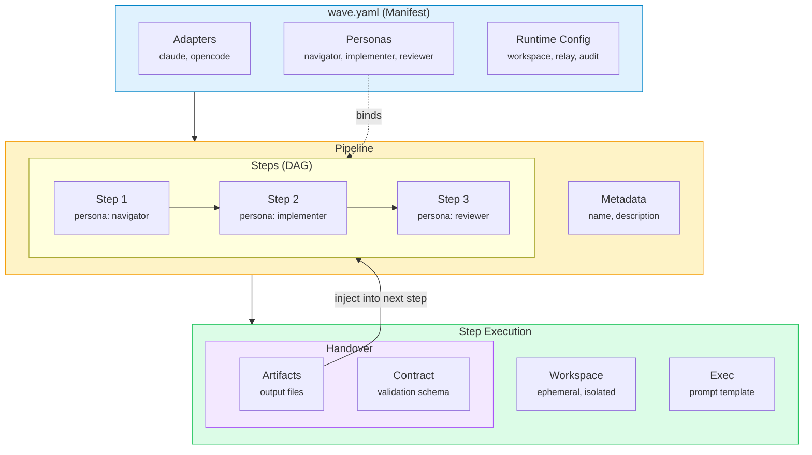

## Concept Relationships

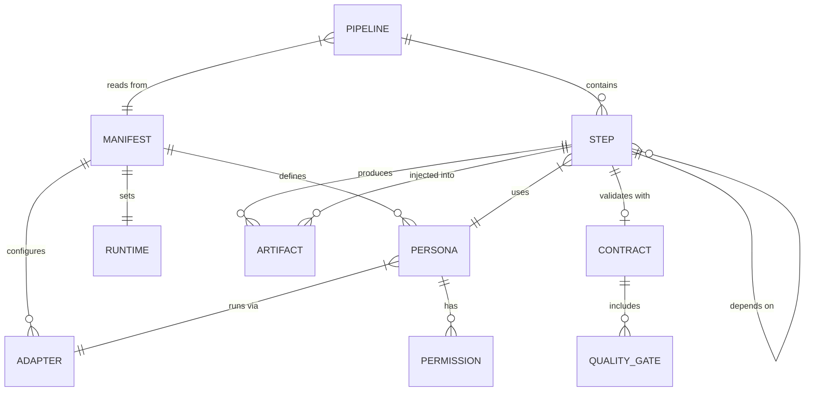

## Simplified Flow

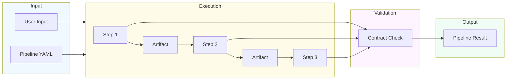

## High-Level System Architecture

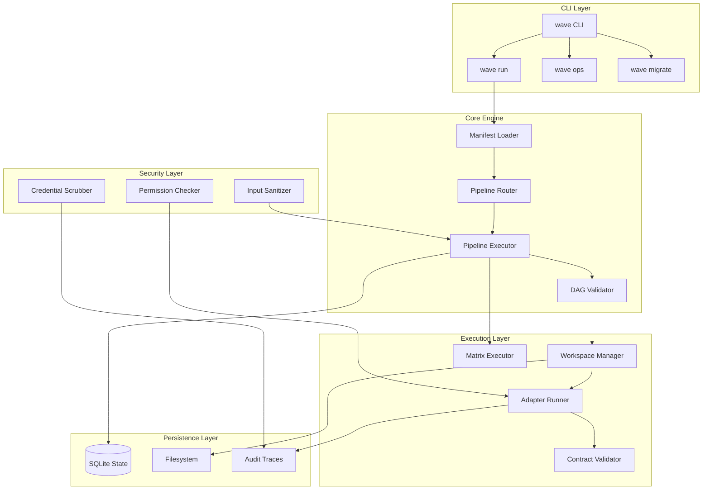

## Pipeline Execution Flow

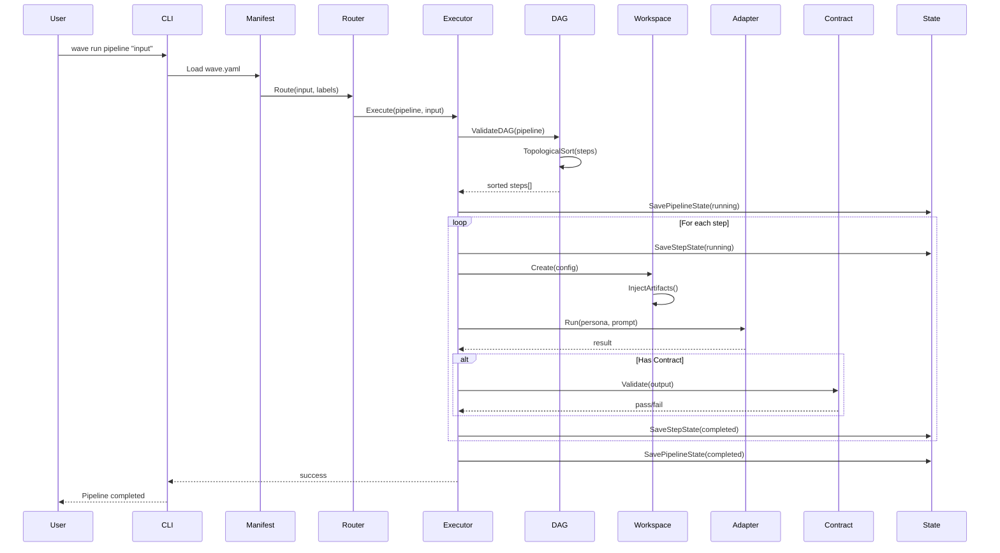

## Step Execution Detail

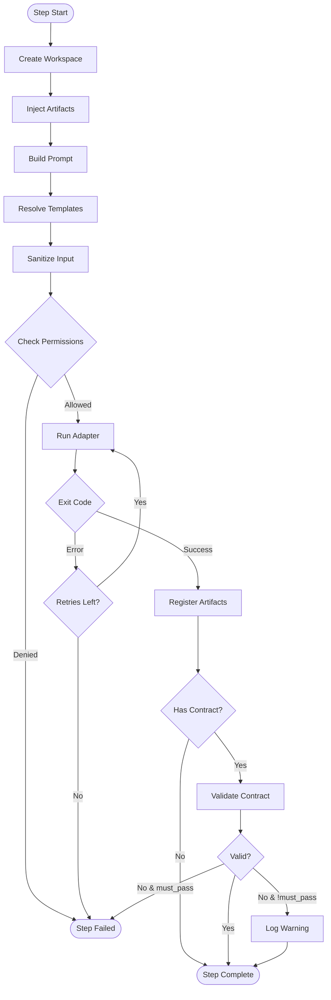

## Persona Permission Model

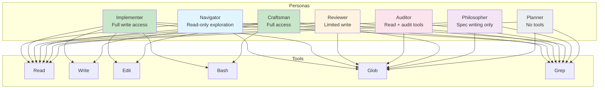

## Permission Check Flow

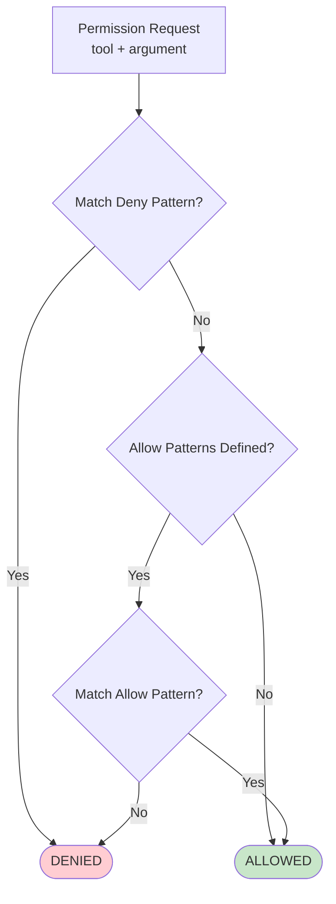

## Contract Validation System

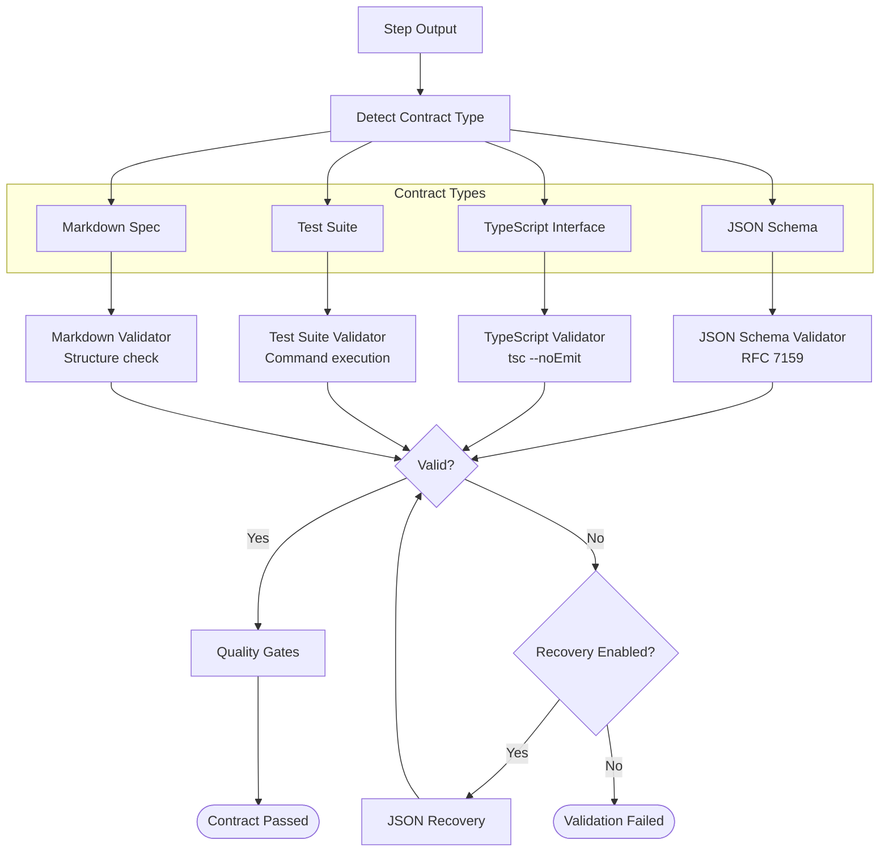

## State Management Schema

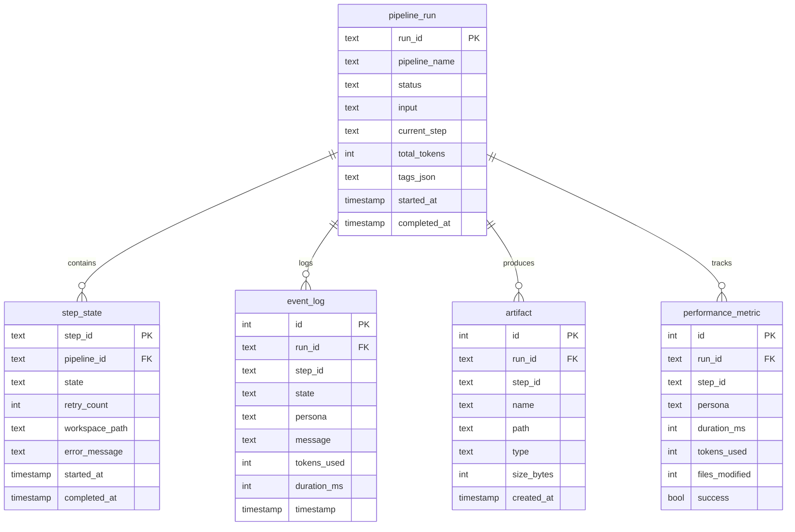

## Workspace Lifecycle

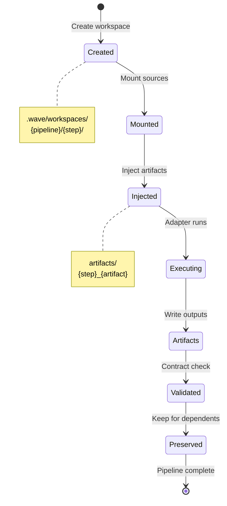

## Artifact Flow Between Steps

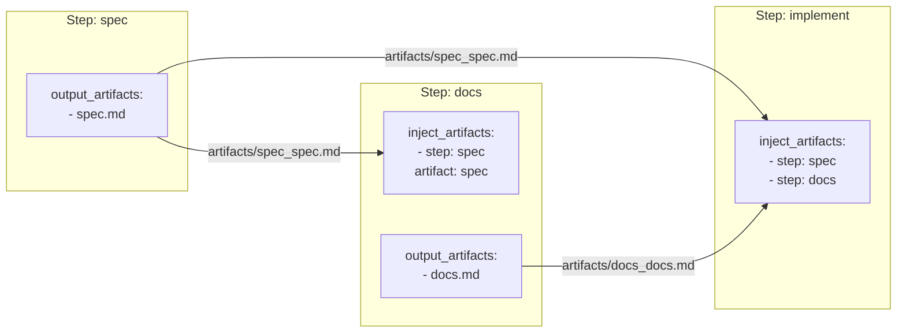

## Matrix Strategy Execution

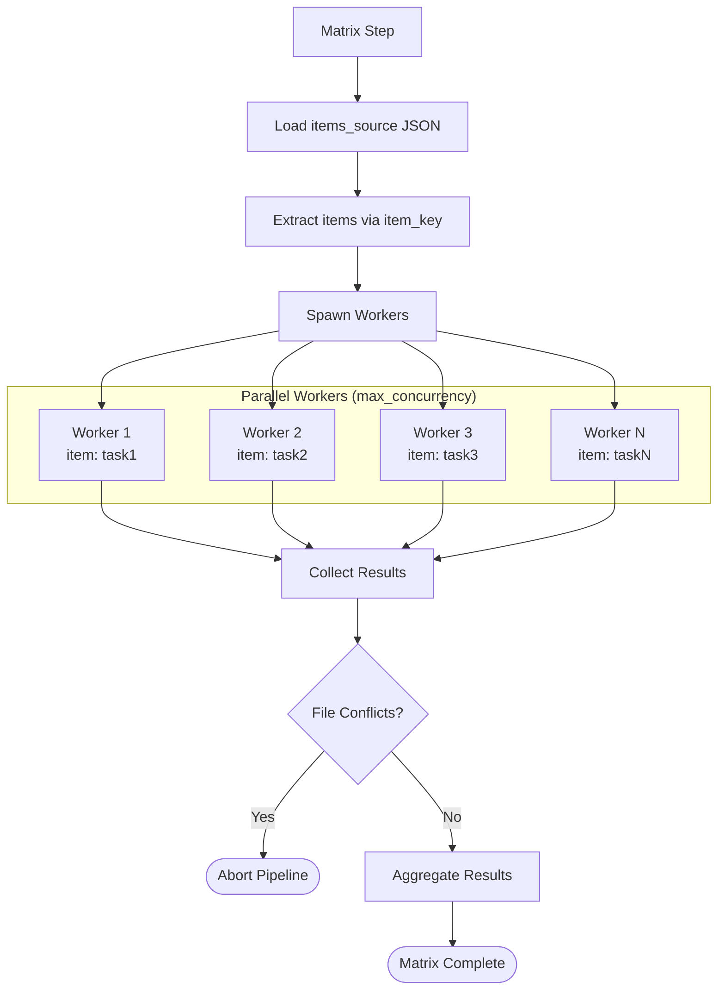

## Security Validation Flow

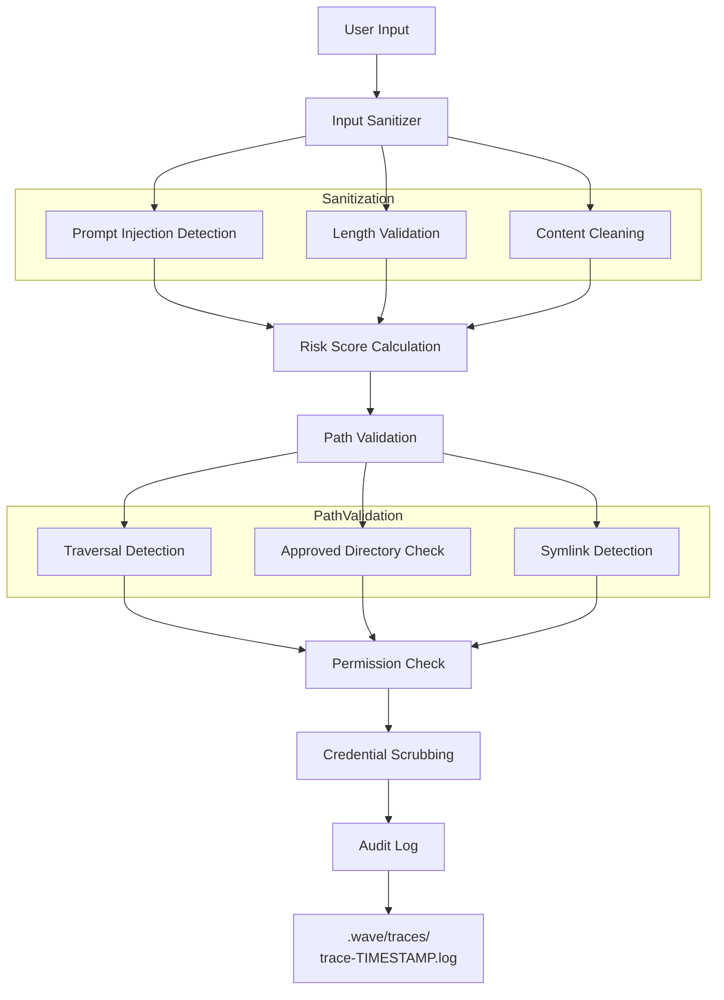

## Resume Flow

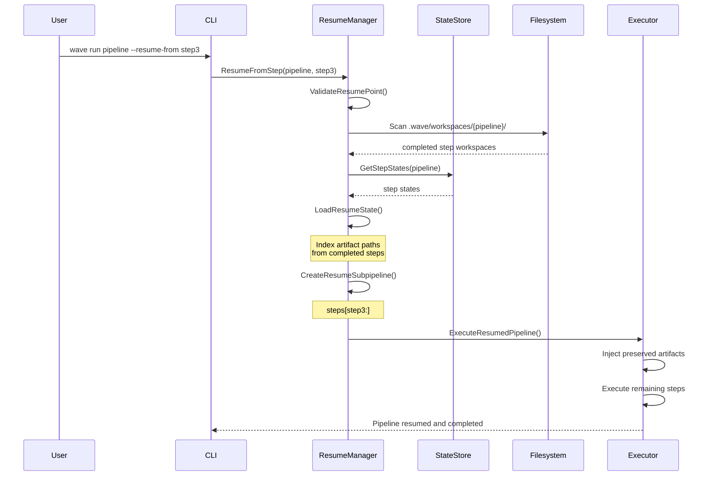

## Event Emission

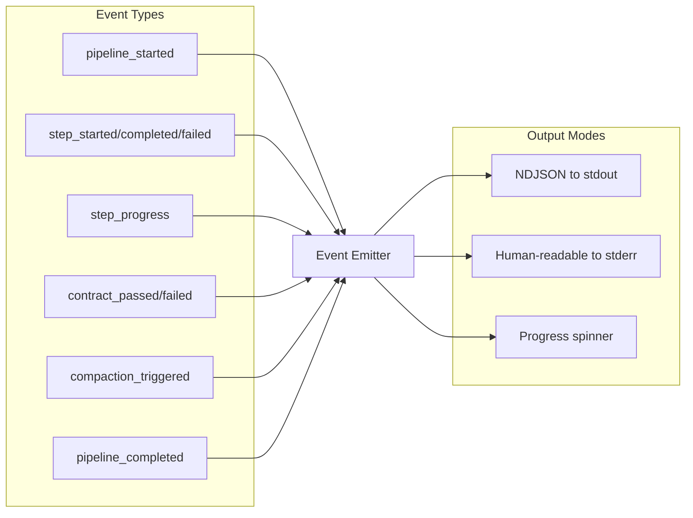

## Complete Data Flow

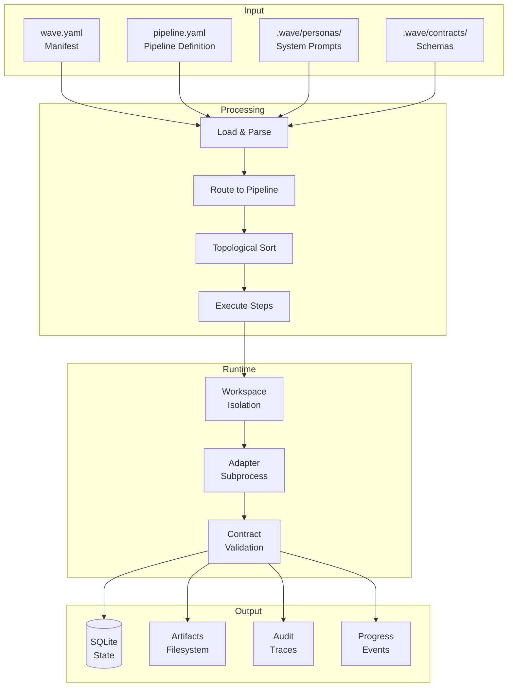
