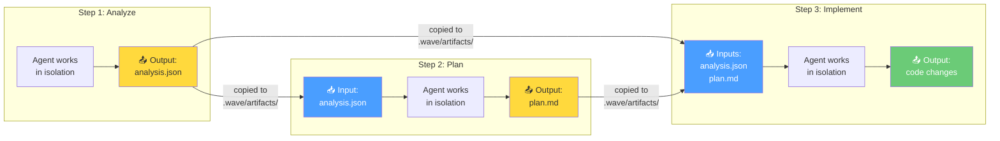
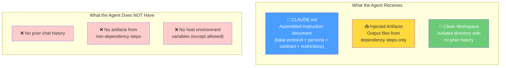
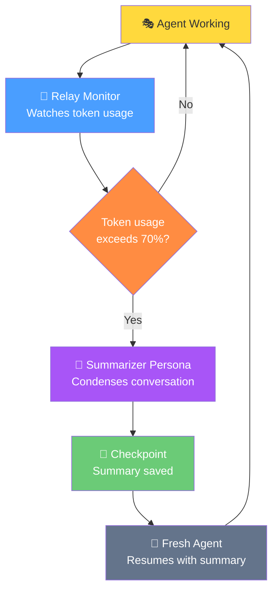

# Context Engineering

Context engineering is how Wave controls **what each AI agent knows** when it starts
working. Unlike a human developer who remembers everything from the day, each Wave
agent starts with a completely blank slate — it has no memory of what happened before.
The only information it receives is what Wave explicitly provides.

This is by design: it prevents agents from being confused by irrelevant context,
ensures reproducible behavior, and maintains security boundaries between steps.

## Artifact Flow Between Steps

Artifacts are the files that steps produce as output and pass to downstream steps.
They are the primary mechanism for inter-step communication.

### How Artifact Injection Works

1. A step completes and produces an output artifact (a file)
2. Wave saves this artifact and records its location
3. When a downstream step starts, Wave checks which artifacts it needs
4. Those artifacts are **copied** into the new step's workspace under `.wave/artifacts/`
5. The agent reads these files to understand what the previous step produced
6. If a schema is specified, Wave validates the artifact format before injection

Only explicitly declared dependencies are injected — a step cannot access artifacts
from steps it does not depend on.

## What Each Agent Sees

When an agent starts, it receives exactly three things — nothing more, nothing less:

## Fresh Memory Principle

Each step begins with **zero memory** of what happened before. This is the "fresh
memory at step boundaries" principle. Even if the same persona runs in two consecutive
steps, it starts clean each time.

**Why?** Because:
- It prevents context pollution — agents cannot be confused by irrelevant history
- It ensures reproducibility — the same inputs always produce the same behavior
- It enforces security — an agent cannot leak information from one step to another
- It keeps token usage efficient — agents do not waste tokens on irrelevant context

## Relay: Handling Long-Running Tasks

Sometimes a single step requires more work than fits in the AI model's context window
(roughly 200,000 tokens). The **Relay Monitor** watches token usage and triggers
compaction when needed.

### How Relay Works

1. The Relay Monitor tracks how many tokens the agent has used
2. When usage exceeds ~70% of the context window, compaction triggers
3. A specialized **Summarizer** persona reads the conversation and produces a concise summary
4. This summary is saved as a **checkpoint**
5. A fresh agent instance starts with the checkpoint summary instead of the full history
6. The agent continues working from where it left off, but with a much smaller context
