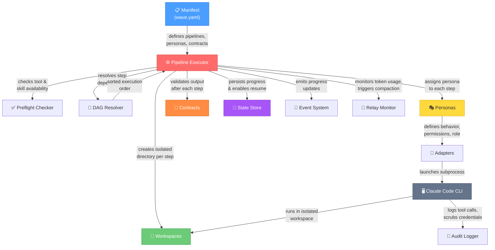

# Wave Architecture Overview

Wave is a **multi-agent pipeline orchestrator** — it coordinates specialized AI agents
to perform complex software engineering tasks as a series of connected steps. Think of
it as an assembly line where each station has a specialist who receives materials from
the previous station, does their part, and passes their work forward.

This diagram shows all the major components and how they relate to each other.

## What Each Component Does

| Component | Purpose |
|-----------|---------|
| **Manifest** | The configuration file (`wave.yaml`) that defines everything: which pipelines exist, which personas are available, and how contracts validate output |
| **Pipeline Executor** | The orchestration engine — reads the manifest, resolves the order of steps, and runs them one by one (or in parallel where possible) |
| **Preflight Checker** | Verifies all required tools and skills are available before the pipeline starts |
| **DAG Resolver** | Determines the correct execution order by analyzing step dependencies — ensures no step runs before its prerequisites are complete |
| **Personas** | Specialized AI agent roles (e.g., navigator, craftsman, reviewer) — each has a defined behavior, permissions, and system prompt |
| **Workspaces** | Isolated directories where each step runs — prevents steps from interfering with each other |
| **Adapters** | The bridge between Wave and the AI CLI tool (Claude Code) — handles subprocess launching and output parsing |
| **Contracts** | Validation rules that check whether a step's output meets quality requirements (JSON schema, test suites, etc.) |
| **State Store** | SQLite database that tracks pipeline progress — enables pausing and resuming pipelines |
| **Event System** | Real-time progress notifications — powers the terminal dashboard and monitoring |
| **Relay Monitor** | Watches token usage during long tasks — triggers context compaction when approaching limits |
| **Audit Logger** | Records all tool calls and actions with credential scrubbing for security and traceability |
