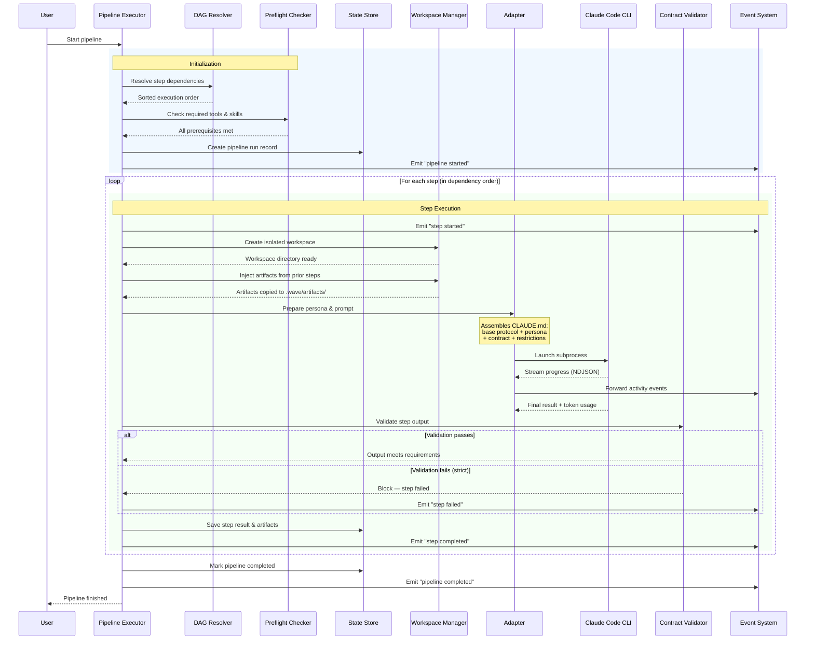
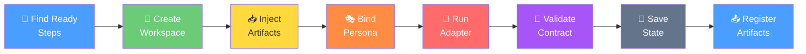

# Pipeline Execution Lifecycle

A pipeline in Wave is a series of connected steps that form a **directed acyclic graph**
(DAG) — a fancy way of saying "steps have dependencies, but there are no circular loops."
The Pipeline Executor processes these steps in the right order, running independent steps
in parallel when possible.

This diagram shows what happens from the moment a pipeline is triggered until it completes.

## Step Execution in Detail

Each step in the pipeline goes through these stages:

## Key Concepts

### Dependency Resolution
Steps declare which other steps they depend on. The DAG Resolver sorts them so that
a step never runs before its prerequisites. Steps with no mutual dependencies can run
in parallel.

### Artifact Flow
When a step completes, its output (called an **artifact**) is saved. Downstream steps
that depend on it receive those artifacts automatically — they appear as files in the
step's workspace under `.wave/artifacts/`.

### Retry and Resume
If a step fails, the executor can retry it (up to a configurable limit). If the entire
pipeline is interrupted, it can be resumed from the last successful step — the State
Store tracks exactly where execution left off.

### Contract Validation
After each step runs, its output is validated against a **contract** — a set of rules
defining what valid output looks like. This catches errors early, before they propagate
to downstream steps.
