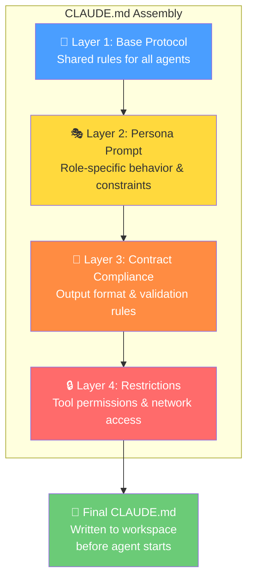
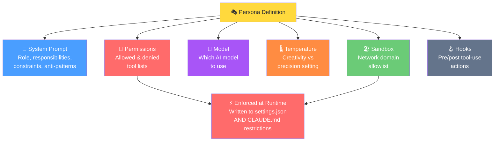

# Prompt Engineering Layers

Every AI agent in Wave receives a carefully assembled instruction document called
**CLAUDE.md**. This document tells the agent who it is, what it should do, what rules
it must follow, and what output format is expected. It is built from four layers,
stacked on top of each other like a sandwich.

This ensures every agent receives consistent operational rules while also getting
role-specific guidance for its particular task.

## CLAUDE.md Assembly

This diagram shows how the four layers combine to form the complete instruction
document for each pipeline step.

### What Each Layer Contains

| Layer | Source | Purpose |
|-------|--------|---------|
| **Base Protocol** | `.wave/personas/base-protocol.md` | Universal rules: fresh context per step, artifact I/O conventions, workspace isolation, no memory of prior steps |
| **Persona Prompt** | `.wave/personas/<name>.md` | Role definition: responsibilities, anti-patterns, quality checklist (e.g., "You are a senior developer focused on clean implementation") |
| **Contract Compliance** | Auto-generated from step config | Output requirements: where to write artifacts, expected JSON schema, validation commands |
| **Restrictions** | Auto-generated from manifest permissions | Security constraints: which tools are denied, which are allowed, which network domains are accessible |

## Persona Definition

Each persona is a named agent role defined in the manifest (`wave.yaml`). Beyond the
system prompt, a persona carries configuration that controls how it behaves at runtime.

## Built-in Personas

Wave ships with several built-in personas, each designed for a specific role in the
development workflow:

| Persona | Role | Key Trait |
|---------|------|-----------|
| **Navigator** | Codebase explorer | Read-only — never modifies files |
| **Craftsman** | Senior developer | Writes production code, runs tests |
| **Implementer** | Code executor | Applies changes, builds, and validates |
| **Reviewer** | Quality auditor | Reviews code without modifying it |
| **Planner** | Task decomposer | Creates plans, never writes code |
| **Summarizer** | Context compactor | Condenses long conversations for relay |

Each persona's permissions are strictly enforced — a navigator cannot write files,
and a reviewer cannot modify source code, regardless of what they are asked to do.
