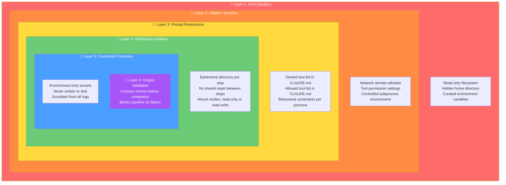
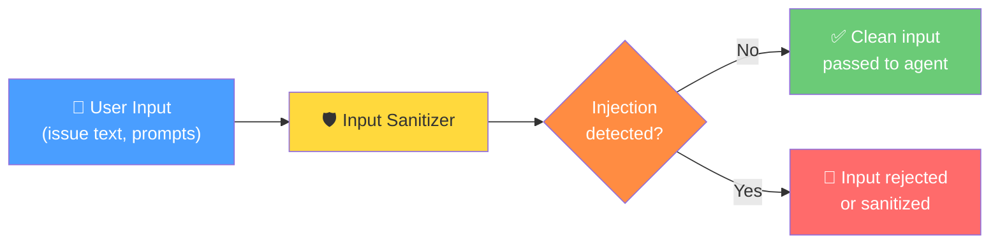
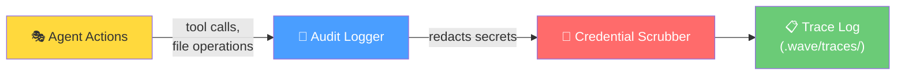

# Security Model

Wave runs AI agents that can execute code, read files, and interact with external
services. This demands a **defense-in-depth** security model — multiple independent
layers of protection, each catching what the others might miss. If any single layer
is bypassed, the remaining layers still provide protection.

This diagram shows the nested security boundaries from outermost (host system) to
innermost (output validation).

## Defense in Depth

## Security Layers Explained

### Layer 1: Host Sandbox (Nix + Bubblewrap)

The outermost defense is an OS-level sandbox that restricts what the entire Wave
process can do on the host machine.

| Control | What It Does |
|---------|-------------|
| **Read-only filesystem** | Prevents writing outside designated directories |
| **Hidden home directory** | AI agents cannot access personal files or credentials |
| **Curated environment** | Only explicitly allowed environment variables pass through |

### Layer 2: Adapter Sandbox

Each AI agent subprocess runs with additional restrictions configured in `settings.json`.

| Control | What It Does |
|---------|-------------|
| **Network domain allowlist** | Agent can only access approved websites and APIs |
| **Tool permission settings** | Controls which tools are auto-approved vs blocked |
| **Minimal environment** | Subprocess receives only essential variables (PATH, HOME, TERM) plus explicitly allowed extras |

### Layer 3: Prompt Restrictions

The CLAUDE.md instruction document includes a restrictions section that tells the
agent what it may and may not do.

| Control | What It Does |
|---------|-------------|
| **Denied tools** | Explicitly lists tools the agent must not use |
| **Allowed tools** | Limits the agent to only specified tools |
| **Persona constraints** | Role-specific rules (e.g., "navigator must never modify files") |

### Layer 4: Workspace Isolation

Each pipeline step runs in its own isolated directory, preventing steps from
interfering with each other.

| Control | What It Does |
|---------|-------------|
| **Ephemeral directories** | Fresh workspace created for each step, discarded after |
| **No shared state** | Steps cannot see each other's workspaces or intermediate files |
| **Mount modes** | Source files can be mounted as read-only or read-write |
| **Fresh memory** | No chat history carries between steps |

### Layer 5: Credential Protection

Secrets and credentials receive special handling to prevent accidental exposure.

| Control | What It Does |
|---------|-------------|
| **Environment-only** | Credentials exist only in environment variables, never on disk |
| **Explicit passthrough** | Only variables listed in `env_passthrough` reach the subprocess |
| **Log scrubbing** | Patterns matching API keys, tokens, passwords are replaced with `[REDACTED]` |

### Layer 6: Output Validation (Contracts)

The final layer validates what the agent produced before accepting it as complete.

| Control | What It Does |
|---------|-------------|
| **Schema validation** | JSON output must match the expected schema |
| **Test suites** | Output must pass automated tests |
| **Strict mode** | Validation failures block the pipeline — no bad output propagates |

## Input Protection

In addition to the output-focused layers above, Wave also protects against malicious
inputs:

The Input Sanitizer scans user-provided text for common prompt injection patterns
(e.g., "ignore previous instructions", "you are now a different agent") and either
sanitizes or rejects suspicious content before it reaches the AI agent.

## Audit Trail

All agent actions are recorded in structured audit logs for traceability and
forensic analysis.

Every tool call, file operation, step start/end, and contract result is logged.
Credential patterns (API keys, tokens, passwords) are automatically replaced with
`[REDACTED]` before writing to disk.
