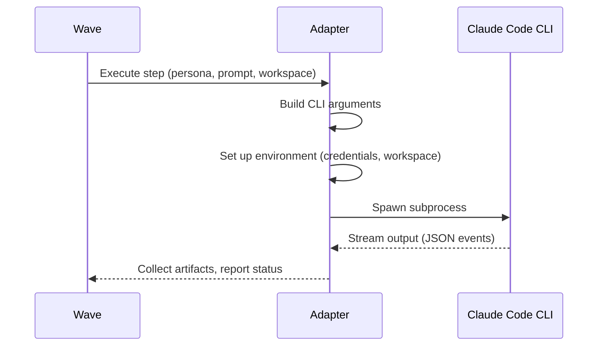

# Adapters

Adapters are the bridge between Wave and LLM CLIs. Each adapter wraps a specific CLI tool (like Claude Code) and defines how Wave spawns, communicates with, and collects output from it.

## How Adapters Work



Wave never communicates with LLM APIs directly. It always goes through an adapter, which invokes the LLM CLI as a subprocess.

## Adapter Configuration

```yaml
adapters:
  claude:
    binary: claude                    # CLI binary name on $PATH
    mode: headless                    # Always subprocess, never interactive
    output_format: json               # Expected output format
    project_files:                    # Files copied into every workspace
      - CLAUDE.md
      - .claude/settings.json
    default_permissions:              # Base permissions for all personas
      allowed_tools: ["Read", "Write", "Edit", "Bash"]
      deny: []
    hooks_template: .wave/hooks/claude/  # Hook scripts to copy
```

### Key Fields

| Field | Purpose |
|-------|---------|
| `binary` | The executable name. Must be on `$PATH`. Wave does not install it. |
| `mode` | Always `"headless"` — Wave runs adapters as subprocesses, never interactive terminals. |
| `output_format` | How to parse adapter output. `"json"` is the standard. |
| `project_files` | Files copied into every workspace that uses this adapter. Useful for tool-specific config. |
| `default_permissions` | Base tool permissions. Personas can override these. |
| `hooks_template` | Directory of hook scripts copied into workspaces. |

## Claude Code Adapter

The primary built-in adapter wraps Claude Code's headless mode:

```bash
# What Wave executes internally:
claude -p "prompt text" \
  --output-format json \
  --max-turns 100 \
  --allowedTools "Read,Write,Bash" \
  --denyTools "Bash(rm -rf *)"
```

### Subprocess Lifecycle

1. Wave builds the CLI command from persona configuration.
2. Generates `settings.json` (permissions, deny rules, sandbox, network domains) and `CLAUDE.md` (system prompt + restriction directives) from the manifest.
3. Spawns the process in the step's ephemeral workspace with a curated environment (only base vars + explicit `env_passthrough`).
4. Monitors stdout for JSON output events.
5. Enforces per-step timeout — kills the entire process group if exceeded.
6. Collects exit code, output artifacts, and duration.

### Process Isolation

Each adapter subprocess runs in its own process group. This ensures:

- Timeout enforcement kills the adapter **and all child processes**.
- Crash of one adapter doesn't affect others.
- Resource limits are per-step, not global.

## Multiple Adapters

A project can define multiple adapters for different LLM tools:

```yaml
adapters:
  claude:
    binary: claude
    mode: headless
    output_format: json

  opencode:
    binary: opencode
    mode: headless
    output_format: json
    default_permissions:
      allowed_tools: ["Read", "Write"]
      deny: ["Bash(rm *)"]
```

Personas select their adapter:

```yaml
personas:
  navigator:
    adapter: claude         # Uses Claude Code

  implementer:
    adapter: opencode       # Uses OpenCode
```

## Custom Adapters

Any CLI that can:

1. Accept a prompt via command-line argument or stdin.
2. Run in a non-interactive (headless) mode.
3. Produce structured output (JSON preferred).

...can be wrapped as a Wave adapter.

```yaml
adapters:
  my-llm:
    binary: my-llm-cli
    mode: headless
    output_format: json
```

See the [Custom Adapter Example](/examples/custom-adapter) for a complete walkthrough.

## Manifest-to-Adapter Projection

Wave projects manifest configuration into adapter-specific config files:

```
wave.yaml persona.permissions.deny     → settings.json permissions.deny
wave.yaml persona.permissions.allowed  → settings.json permissions.allow
wave.yaml persona.sandbox.allowed_domains → settings.json sandbox.network.allowedDomains
wave.yaml persona system prompt        → CLAUDE.md (persona section)
wave.yaml permissions + sandbox        → CLAUDE.md (restriction section)
```

This ensures Claude Code is informed of restrictions at both the configuration level (settings.json enforces it) and the prompt level (CLAUDE.md makes the model aware of it).

## Credential Handling

Adapters receive credentials via a **curated environment** — only base variables and those explicitly listed in `runtime.sandbox.env_passthrough` are passed. The full host environment is never inherited.

```
Shell → env_passthrough filter → Wave process → Adapter subprocess → LLM CLI
```

See [Environment & Credentials](/reference/environment) for details.

## Further Reading

- [Manifest Schema — Adapter Fields](/reference/manifest-schema#adapter) — complete field reference
- [Personas](/concepts/personas) — how personas bind to adapters
- [Custom Adapter Example](/examples/custom-adapter) — writing your own adapter
