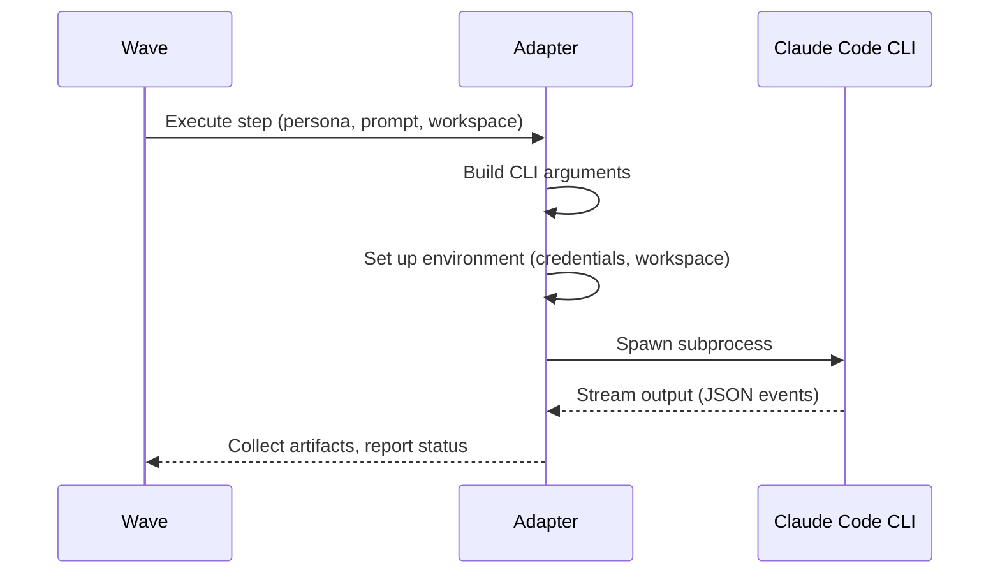

# Adapters

Adapters are the bridge between Wave and LLM CLIs. Each adapter wraps a specific CLI tool (like Claude Code) and defines how Wave spawns, communicates with, and collects output from it.

## How Adapters Work


```mermaid
sequenceDiagram
    participant M as Wave
    participant A as Adapter
    participant C as Claude Code CLI
    M->>A: Execute step (persona, prompt, workspace)
    A->>A: Build CLI arguments
    A->>A: Set up environment (credentials, workspace)
    A->>C: Spawn subprocess
    C-->>A: Stream output (JSON events)
    A-->>M: Collect artifacts, report status
```

Wave never communicates with LLM APIs directly. It always goes through an adapter, which invokes the LLM CLI as a subprocess.

## Adapter Configuration

```yaml
adapters:
  claude:
    binary: claude                    # CLI binary name on $PATH
    mode: headless                    # Always subprocess, never interactive
    output_format: json               # Expected output format
    project_files:                    # Files copied into every workspace
      - CLAUDE.md
      - .claude/settings.json
    tier_models:                     # Model selection by complexity tier
      cheapest: haiku                # Cost-optimized model
      fastest: ""                    # Use adapter default (empty)
      strongest: opus                # Capability-optimized model
    default_permissions:              # Base permissions for all personas
      allowed_tools: ["Read", "Write", "Edit", "Bash"]
      deny: []
    hooks_template: .wave/hooks/claude/  # Hook scripts to copy
```

### Key Fields

| Field | Purpose |
|-------|---------|
| `binary` | The executable name. Must be on `$PATH`. Wave does not install it. |
| `mode` | Always `"headless"` — Wave runs adapters as subprocesses, never interactive terminals. |
| `output_format` | How to parse adapter output. `"json"` is the standard. |
| `project_files` | Files copied into every workspace that uses this adapter. Useful for tool-specific config. |
| `tier_models` | Maps complexity tiers (`cheapest`, `fastest`, `strongest`) to model identifiers for auto-routing. |
| `default_permissions` | Base tool permissions. Personas can override these. |
| `hooks_template` | Directory of hook scripts copied into workspaces. |

## Claude Code Adapter

The primary built-in adapter wraps Claude Code's headless mode:

```bash
# What Wave executes internally:
claude -p "prompt text" \
  --model opus \
  --allowedTools "Read,Write,Bash" \
  --output-format stream-json \
  --verbose \
  --dangerously-skip-permissions \
  --no-session-persistence
```

### Subprocess Lifecycle

1. Wave builds the CLI command from persona configuration.
2. Generates `settings.json` (permissions, deny rules, sandbox, network domains) and `CLAUDE.md` (system prompt + restriction directives) from the manifest.
3. Spawns the process in the step's ephemeral workspace with a curated environment (only base vars + explicit `env_passthrough`). Both the Claude and OpenCode adapters use this curated model; only raw `ProcessGroupRunner`-based adapters inherit the full host environment.
4. Monitors stdout for JSON output events.
5. Enforces per-step timeout — kills the entire process group if exceeded.
6. Collects exit code, output artifacts, and duration.

### Process Isolation

Each adapter subprocess runs in its own process group. This ensures:

- Timeout enforcement kills the adapter **and all child processes**.
- Crash of one adapter doesn't affect others.
- Resource limits are per-step, not global.

## Multiple Adapters

A project can define multiple adapters for different LLM tools. Wave ships with built-in adapters for Claude, OpenCode, Gemini, and Codex:

```yaml
adapters:
  claude:
    binary: claude
    mode: headless
    output_format: json

  opencode:
    binary: opencode
    mode: headless
    output_format: json
    default_permissions:
      allowed_tools: ["Read", "Write"]
      deny: ["Bash(rm *)"]

  gemini:
    binary: gemini
    mode: headless
    output_format: json

  codex:
    binary: codex
    mode: headless
    output_format: json
```

### Adapter Selection Hierarchy

Adapter selection follows a four-tier precedence hierarchy:

```
CLI --adapter flag > step.adapter (pipeline YAML) > persona.adapter > manifest default
```

**Persona-level selection** — bind an adapter in the persona definition:

```yaml
personas:
  navigator:
    adapter: claude         # Uses Claude Code

  implementer:
    adapter: opencode       # Uses OpenCode
    model: openai/gpt-4o   # provider=openai, model=gpt-4o
```

**Step-level selection** — override the persona's adapter for a specific pipeline step:

```yaml
pipelines:
  my-pipeline:
    steps:
      - name: heavy-reasoning
        adapter: claude
        persona: navigator
      - name: quick-format
        adapter: opencode
        persona: implementer
```

**CLI flag override** — override all adapter selection at runtime:

```bash
wave run my-pipeline --adapter opencode --model "zai-coding-plan/glm-5-turbo"
```

For OpenCode personas, the `model` field uses a `provider/model` identifier format — the string is split on the first `/` to derive the provider and model name. If `model` is omitted for an OpenCode persona, it defaults to `anthropic/claude-sonnet-4-20250514`.

## Browser Adapter

The browser adapter provides headless browser automation via the Chrome DevTools Protocol (CDP), powered by `chromedp`. It is designed for personas that need to scrape web pages, take screenshots, or interact with web UIs as part of a pipeline step.

Unlike the Claude and OpenCode adapters, the browser adapter does not wrap an LLM CLI. Instead, it receives a JSON array of browser commands as its prompt and executes them sequentially against a headless Chrome instance.

### Supported Actions

| Action | Required Fields | Description |
|--------|-----------------|-------------|
| `navigate` | `url` | Navigate to a URL, return page title and final URL |
| `screenshot` | - | Capture a full-page screenshot (base64-encoded PNG) |
| `get_text` | - | Extract `innerText` from a selector or full page body |
| `get_html` | - | Extract `outerHTML` from a selector or full document |
| `click` | `selector` | Click an element matching the CSS selector |
| `type` | `selector`, `value` | Type text into an input matching the CSS selector |

All actions accept optional `wait_for` (CSS selector to wait for before executing) and `timeout_ms` (per-command timeout, default 30000) fields.

### Configuration

```yaml
adapters:
  browser:
    binary: ""                        # Not applicable — uses embedded chromedp
    mode: headless
    output_format: json
```

Browser-specific settings are configured in the adapter code with sensible defaults:

| Setting | Default | Description |
|---------|---------|-------------|
| `headless` | `true` | Run Chrome in headless mode |
| `viewport_width` | `1280` | Browser viewport width (max 3840) |
| `viewport_height` | `720` | Browser viewport height (max 2160) |
| `max_redirects` | `10` | Maximum redirect hops before failing |
| `max_response_size` | `5MB` | Response truncation limit for `get_text`/`get_html` |
| `command_timeout` | `30s` | Default per-command timeout |

### Domain Filtering

When the persona's `sandbox.allowed_domains` is configured, the browser adapter uses CDP fetch interception to block requests to non-allowed domains. Wildcard patterns (e.g., `*.example.com`) are supported.

### Example Prompt (JSON)

```json
[
  {"action": "navigate", "url": "https://example.com"},
  {"action": "get_text", "selector": "#content"},
  {"action": "screenshot"}
]
```

### Security

- Each command runs inside the same CDP session with process-group isolation.
- When the manifest sandbox is enabled, Chrome extensions, plugins, and popup blocking are disabled.
- Domain filtering enforces network access restrictions at the CDP level, complementing the Nix/bubblewrap outer sandbox.

Key source: `internal/adapter/browser.go`

---

## Custom Adapters

Any CLI that can:

1. Accept a prompt via command-line argument or stdin.
2. Run in a non-interactive (headless) mode.
3. Produce structured output (JSON preferred).

...can be wrapped as a Wave adapter.

```yaml
adapters:
  my-llm:
    binary: my-llm-cli
    mode: headless
    output_format: json
```

See the [Custom Adapter Example](/examples/custom-adapter) for a complete walkthrough.

## Manifest-to-Adapter Projection

Wave projects manifest configuration into adapter-specific config files:

```
wave.yaml persona.permissions.deny     → settings.json permissions.deny
wave.yaml persona.permissions.allowed  → settings.json permissions.allow
wave.yaml persona.sandbox.allowed_domains → settings.json sandbox.network.allowedDomains
wave.yaml persona system prompt        → CLAUDE.md (persona section)
wave.yaml permissions + sandbox        → CLAUDE.md (restriction section)
```

This ensures Claude Code is informed of restrictions at both the configuration level (settings.json enforces it) and the prompt level (CLAUDE.md makes the model aware of it).

## Credential Handling

Adapters receive credentials via a **curated environment** — only base variables and those explicitly listed in `runtime.sandbox.env_passthrough` are passed. Both the Claude and OpenCode adapters enforce this curated model. Only raw `ProcessGroupRunner`-based adapters inherit the full host environment via `os.Environ()`.

```
Shell → env_passthrough filter → Wave process → Adapter subprocess → LLM CLI
```

See [Environment & Credentials](/reference/environment) for details.

## Further Reading

- [Manifest Schema — Adapter Fields](/reference/manifest-schema#adapter) — complete field reference
- [Personas](/concepts/personas) — how personas bind to adapters
- [Custom Adapter Example](/examples/custom-adapter) — writing your own adapter
