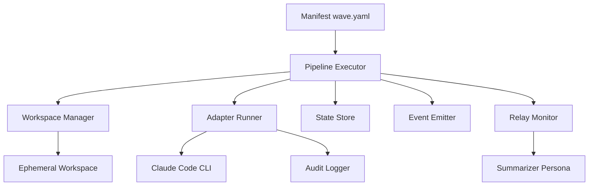
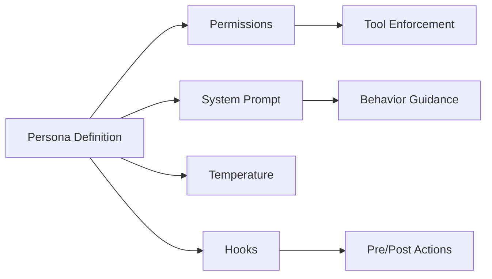

# Wave Architecture

## Overview

Wave is a multi-agent orchestrator that wraps Claude Code (and other LLM CLIs) to execute complex workflows through pipeline DAGs. It enforces safety through personas, contracts, and workspace isolation.

## Core Components



## Manifest System

The manifest (`wave.yaml`) is the single source of truth:

- **Adapters**: Define how to invoke LLM CLIs
- **Personas**: Define agent roles, permissions, and behaviors
- **Runtime**: Global settings like workspace root and limits
- **Pipelines**: DAG definitions for workflows

## Pipeline Execution Engine

### DAG Resolution

Pipelines are resolved to execution order:
1. Parse YAML structure
2. Validate step dependencies
3. Detect cycles (error if found)
4. Topological sort for execution order

### Step Execution Loop

For each step:
1. Create ephemeral workspace
2. Inject artifacts from dependencies
3. Bind persona configuration
4. Invoke adapter subprocess
5. Monitor for timeout/relay trigger
6. Validate handover contract
7. Persist state
8. Emit progress event

## Workspace Isolation

Each step runs in isolation:

```
/tmp/wave/<pipeline-id>/<step-id>/
├── src/              # Mounted readonly from repo
├── artifacts/         # Step outputs
├── .claude/           # Claude Code settings
└── CLAUDE.md         # Persona system prompt
```

## Persona System

Personas enforce boundaries:



## Context Relay

Long-running tasks trigger relay:

1. Monitor token usage
2. At threshold (default 80%), trigger compaction
3. Summarizer persona creates checkpoint
4. Fresh instance resumes from checkpoint

## Handover Contracts

Contracts validate between steps:

- **JSON Schema**: Structure validation
- **TypeScript Interface**: Compile checking
- **Test Suite**: Behavioral validation

Failed contracts trigger retries or pipeline halt.

## Security Model

### Permission Enforcement

- Deny patterns take precedence
- Evaluated before tool invocation
- Persona-scoped restrictions

### Credential Handling

- Never written to disk
- Passed via environment variables
- Scrubbed from audit logs

### Audit Trail

- All tool calls logged when enabled
- File operations tracked
- Structured JSON output for parsing

## Performance Characteristics

### Concurrency

- Matrix strategy for parallel workers
- Configurable concurrency limits
- Goroutine-based execution

### Resource Usage

- Workspace cleanup is manual
- State persisted in SQLite
- Single static binary, no runtime deps

### Scalability Limits

- Up to 20 steps per pipeline
- Up to 10 concurrent workers
- Repositories up to 1M LOC

## Failure Handling

### Step Failures

1. Transition to `retrying` state
2. Exponential backoff
3. Max retries configurable per step
4. Pipeline halts on exceeded retries

### Process Crashes

1. Process group isolation
2. Timeout kills entire tree
3. Workspace preserved for debugging

### System Failures

1. State persisted before failure
2. Resumable from last completed step
3. Detailed error reporting

## Integration Points

### Adapter Interface

Pluggable adapter system:
- Claude Code (implemented)
- OpenCode (future)
- Custom adapters via configuration

### Hooks System

Pre/post tool execution:
- Security checks
- Quality gates
- Custom validation

### Event System

Structured events for:
- CI/CD integration
- Monitoring systems
- Custom tooling

## Design Principles

1. **Single Source of Truth**: Manifest drives all behavior
2. **Persona Boundaries**: Clear security and role separation
3. **Fresh Memory**: No shared state between steps
4. **Contract Validation**: Quality gates at boundaries
5. **Observable Execution**: All state changes emit events
6. **Graceful Failure**: Retry and recovery mechanisms