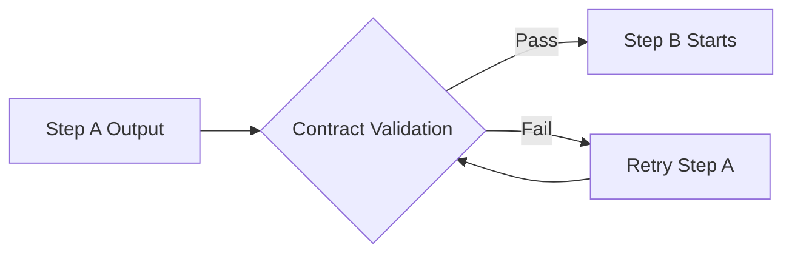

# Handover Contracts: Guaranteed AI Outputs

Contracts are Wave's **core differentiator** - they transform unpredictable AI interactions into guaranteed, reliable outputs. Unlike traditional AI tools where you hope the output is correct, Wave's contracts **enforce** that outputs meet your exact requirements.

## The AI Reliability Revolution

Traditional AI development is fundamentally unpredictable - you get whatever the AI decides to give you. Wave changes this by providing **Infrastructure-as-Code reliability** for AI workflows through enforced validation contracts.

Contracts are validation gates at step boundaries that ensure each step's output meets quality requirements before the next step begins. Without contracts, a poorly-formed artifact propagates through the entire pipeline before anyone notices.

## Why Contracts Are Essential

**The Problem Wave Solves:**

Traditional AI interactions:
```
User: "Generate API documentation in JSON format"
AI: Returns markdown instead
User: "I need JSON, not markdown"
AI: Returns invalid JSON structure
User: "Please follow the exact schema"
AI: Returns JSON but missing required fields
```

**Wave's Solution:**

With contracts, this becomes:
```yaml
handover:
  contract:
    type: json_schema
    schema: .wave/contracts/api-docs.schema.json
    on_failure: retry
    max_retries: 3
```

Wave **guarantees** the output matches your schema or automatically retries until it does.

**Pipeline-Level Quality Assurance:**

Consider a pipeline where the navigator produces a codebase analysis, and the craftsman implements based on it. If the analysis is missing critical file paths, the craftsman wastes tokens implementing the wrong thing. Contracts catch this at the boundary and ensure quality data flows through your entire pipeline.



## Contract Types

Wave supports three contract types, each validating at a different level:

### JSON Schema

Validates output structure against a JSON Schema definition. Best for checking that artifacts contain required fields and correct types.

```yaml
handover:
  contract:
    type: json_schema
    schema: .wave/contracts/navigation.schema.json
    source: output/analysis.json
    on_failure: retry
    max_retries: 2
```

Example schema:
```json
{
  "$schema": "http://json-schema.org/draft-07/schema#",
  "type": "object",
  "required": ["files", "patterns", "dependencies"],
  "properties": {
    "files": {
      "type": "array",
      "items": { "type": "string" },
      "minItems": 1
    },
    "patterns": {
      "type": "array",
      "items": {
        "type": "object",
        "required": ["name", "description"],
        "properties": {
          "name": { "type": "string" },
          "description": { "type": "string" }
        }
      }
    },
    "dependencies": { "type": "object" }
  }
}
```

### TypeScript Interface

Validates that generated TypeScript compiles against a declared interface. Best for checking that generated types or contracts are syntactically valid.

```yaml
handover:
  contract:
    type: typescript_interface
    source: output/types.ts
    validate: true
    on_failure: retry
    max_retries: 2
```

If `tsc` is not available in the environment, this degrades to syntax-only validation.

### Test Suite

Validates step output by running a test command. The most flexible contract type — any executable check can serve as validation.

```yaml
handover:
  contract:
    type: test_suite
    command: "npm test -- --testPathPattern=profile.test"
    must_pass: true
    on_failure: retry
    max_retries: 3
```

## Failure Handling

When a contract fails:

| `on_failure` | Behavior |
|-------------|----------|
| `retry` | Re-run the step with a fresh workspace. Retry count increments. |
| `halt` | Stop the pipeline immediately. Step transitions to `failed`. |

```yaml
handover:
  contract:
    on_failure: retry    # Try again
    max_retries: 3       # Up to 3 attempts
```

After `max_retries` is exceeded, the step transitions to `failed` regardless of `on_failure` setting.

### Retry Behavior

- Each retry gets a **fresh workspace** — no leftover state from the failed attempt.
- The retry budget is **per-step**, not per-pipeline.
- Retries use **exponential backoff** between attempts.
- Subprocess crashes and timeouts count as failures and use the same retry mechanism.

## Contract Placement

Contracts live on the **producing** step (the step whose output is validated), not the consuming step:

```yaml
steps:
  - id: navigate
    # ... execution config ...
    handover:
      contract:          # ← Validates navigate's output
        type: json_schema
        schema: .wave/contracts/nav.schema.json
        source: output/analysis.json

  - id: implement
    dependencies: [navigate]
    # If we get here, navigate's output is guaranteed valid
```

## Contract Design Patterns

### Progressive Validation

Use stricter contracts as the pipeline progresses:

```yaml
# Early steps: structural checks only
- id: navigate
  handover:
    contract:
      type: json_schema        # "Does the output have the right shape?"

# Middle steps: compilation checks
- id: specify
  handover:
    contract:
      type: typescript_interface  # "Does the output compile?"

# Late steps: behavioral checks
- id: implement
  handover:
    contract:
      type: test_suite           # "Does the output work correctly?"
```

### Schema Reuse

Store contract schemas in `.wave/contracts/` and reference them across pipelines:

```
.wave/contracts/
├── navigation.schema.json
├── specification.schema.json
├── implementation.schema.json
└── review.schema.json
```

## Contracts as Wave's Core Value Proposition

Contracts are what make Wave different from traditional AI tools:

- **Traditional AI**: Hope the output is correct, manually check everything
- **Wave**: Guarantee the output is correct, automatically validated

- **Traditional AI**: Inconsistent results across team members
- **Wave**: Consistent, validated results for everyone

- **Traditional AI**: Manual quality assurance at every step
- **Wave**: Automated quality gates built into the workflow

This reliability transformation is why Wave can support **production AI workflows** rather than just individual productivity tools.

## Enterprise Benefits

### Predictable Quality
Teams can rely on AI outputs for production use because contracts ensure consistency and correctness.

### Automated Quality Assurance
No more manual checking of AI outputs - contracts validate automatically and retry on failure.

### Scalable AI Adoption
Organizations can standardize on reliable AI workflows rather than hoping individual developers use AI correctly.

### Audit and Compliance
All contract validations are logged, providing audit trails for AI-generated content in regulated environments.

## Further Reading

- [Deliverables and Contracts](/paradigm/deliverables-contracts) — The paradigm behind guaranteed AI outputs
- [Pipeline Schema — HandoverConfig](/reference/pipeline-schema#handoverconfig) — Complete field reference
- [Pipelines](/concepts/pipelines) — How contracts fit into step execution
- [Speckit Flow Example](/examples/speckit-flow) — Contracts in a real pipeline
