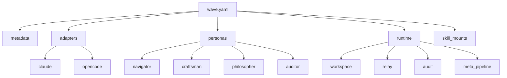

# Manifests

The manifest (`wave.yaml`) is the single source of truth for all Wave orchestration behavior. Every pipeline, persona, adapter, and runtime setting traces back to this file.

## Why a Single File?

Wave deliberately consolidates configuration into one file rather than scattering it across directories:

- **Auditable** — one file to review for security and correctness.
- **Versionable** — the manifest is committed alongside your source code.
- **Portable** — move the file and the project's orchestration moves with it.
- **Validatable** — `wave validate` checks the entire configuration in one pass.

## Manifest Structure



### Section Responsibilities

| Section | Purpose | Required |
|---------|---------|----------|
| `metadata` | Project identification — name, description, repo URL | **yes** |
| `adapters` | LLM CLI configurations — binary paths, modes, default permissions | **yes** |
| `personas` | Agent role definitions — prompts, temperatures, permissions, hooks | **yes** |
| `runtime` | Execution settings — workspace root, concurrency, timeouts, relay | **yes** |
| `skill_mounts` | External skill directories for discovery | no |

## Manifest Lifecycle

```
wave init          → Creates scaffold manifest
     ↓
Edit wave.yaml     → Configure for your project
     ↓
wave validate      → Check syntax and references
     ↓
wave run           → Execute pipelines using manifest config
```

## Reference Resolution

The manifest uses **string references** to connect entities:

```yaml
personas:
  navigator:
    adapter: claude     # ← References adapters.claude
    system_prompt_file: .wave/personas/navigator.md  # ← File on disk

steps:
  - persona: navigator  # ← References personas.navigator
    dependencies: [analyze]  # ← References another step ID
```

`wave validate` checks all these references at validation time, before any pipeline runs.

## Manifest vs Pipeline Files

| Concern | Where |
|---------|-------|
| Adapters, personas, runtime | `wave.yaml` (project-wide) |
| Step DAGs, execution logic | `.wave/pipelines/*.yaml` (per-workflow) |

Pipelines are separate files because a project may have many workflows (feature development, hotfix, CI/CD, etc.) sharing the same adapters and personas.

## Further Reading

- [Manifest Schema Reference](/reference/manifest-schema) — complete field-by-field reference
- [Configuration Guide](/guide/configuration) — practical configuration walkthrough
- [Adapters](/concepts/adapters) — how adapters work
- [Personas](/concepts/personas) — the persona system
