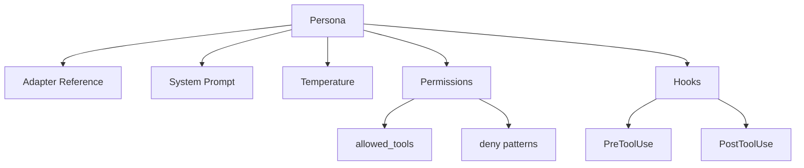

# Personas

Personas are the safety and specialization mechanism in Wave. Each persona defines a **role** — what an agent can see, do, and how it behaves. Personas enforce separation of concerns so that a read-only navigator cannot write files and a craftsman cannot install arbitrary dependencies.

## Why Personas?

Without persona scoping, every agent has identical permissions and context. This creates risk:

- A navigation step could accidentally modify files.
- An implementation step could bypass security checks.
- A review step could "fix" issues rather than report them.

Personas solve this by **binding capabilities to roles**.

## Built-in Personas

Wave ships with 7 specialized personas:

| Persona | Temp | Purpose |
|---------|------|---------|
| `navigator` | 0.1 | Read-only codebase exploration |
| `philosopher` | 0.3 | Architecture and specification |
| `planner` | 0.3 | Task breakdown and planning |
| `craftsman` | 0.7 | Implementation and testing |
| `debugger` | 0.2 | Systematic issue diagnosis |
| `auditor` | 0.1 | Security and quality review |
| `summarizer` | 0.0 | Context compaction |

## Persona Anatomy



| Component | Purpose |
|-----------|---------|
| **Adapter** | Which LLM CLI to use (e.g., `claude`, `opencode`). |
| **System Prompt** | Markdown file defining the agent's role, goals, and constraints. |
| **Temperature** | Controls output determinism. Low (0.1) for analysis, high (0.7) for creative work. |
| **Permissions** | Tool access control — what the agent can and cannot do. |
| **Hooks** | Shell commands that execute before/after tool calls. |

## Persona Definitions

### Navigator

Read-only codebase exploration. Finds files, analyzes patterns, maps architecture. Never modifies anything.

```yaml
navigator:
  adapter: claude
  system_prompt_file: .wave/personas/navigator.md
  temperature: 0.1
  permissions:
    allowed_tools: ["Read", "Glob", "Grep", "Bash(git log*)", "Bash(git status*)"]
    deny: ["Write(*)", "Edit(*)", "Bash(git commit*)", "Bash(git push*)"]
```

### Philosopher

Design and specification. Creates specs, plans, and contracts. Limited to writing in specification directories.

```yaml
philosopher:
  adapter: claude
  system_prompt_file: .wave/personas/philosopher.md
  temperature: 0.3
  permissions:
    allowed_tools: ["Read", "Write(.wave/specs/*)"]
    deny: ["Bash(*)"]
```

### Planner

Task breakdown and project planning. Decomposes features into ordered, actionable steps.

```yaml
planner:
  adapter: claude
  system_prompt_file: .wave/personas/planner.md
  temperature: 0.3
  permissions:
    allowed_tools: ["Read", "Glob", "Grep"]
    deny: ["Write(*)", "Edit(*)", "Bash(*)"]
```

### Craftsman

Full implementation capability. Reads, writes, edits, and runs commands. Protected by hooks for dangerous operations.

```yaml
craftsman:
  adapter: claude
  system_prompt_file: .wave/personas/craftsman.md
  temperature: 0.7
  permissions:
    allowed_tools: ["Read", "Write", "Edit", "Bash"]
    deny: ["Bash(rm -rf /*)"]
  hooks:
    PreToolUse:
      - matcher: "Bash(git commit*)"
        command: ".wave/hooks/pre-commit-lint.sh"
```

### Debugger

Systematic issue diagnosis with hypothesis testing and root cause analysis.

```yaml
debugger:
  adapter: claude
  system_prompt_file: .wave/personas/debugger.md
  temperature: 0.2
  permissions:
    allowed_tools: ["Read", "Grep", "Glob", "Bash(go test*)", "Bash(git bisect*)"]
    deny: ["Write(*)", "Edit(*)"]
```

### Auditor

Security review and quality assurance. Read-only access plus specific analysis commands.

```yaml
auditor:
  adapter: claude
  system_prompt_file: .wave/personas/auditor.md
  temperature: 0.1
  permissions:
    allowed_tools: ["Read", "Grep", "Bash(npm audit*)", "Bash(go vet*)"]
    deny: ["Write(*)", "Edit(*)"]
```

### Summarizer

Context relay checkpoint generation. Minimal permissions — reads context and produces a checkpoint document.

```yaml
summarizer:
  adapter: claude
  system_prompt_file: .wave/personas/summarizer.md
  temperature: 0.0
  permissions:
    allowed_tools: ["Read"]
    deny: ["Write(*)", "Bash(*)"]
```

## Permission Model

Permissions use glob patterns matched against tool call signatures.

### Evaluation Order

```
1. Check deny patterns → MATCH = blocked
2. Check allowed_tools → MATCH = permitted
3. No match → blocked (implicit deny)
```

Deny **always wins**. A tool call matching both `allowed_tools` and `deny` is blocked.

### Inheritance

```
Adapter default_permissions (base)
         ↓
Persona permissions (override)
         ↓
Effective permissions (final)
```

- Persona `deny` patterns are **additive** (combined with adapter denies).
- Persona `allowed_tools` **replace** adapter allowed tools when specified.

## Hooks

Hooks inject custom logic at tool call boundaries:

| Hook | Timing | Blocking |
|------|--------|----------|
| `PreToolUse` | Before tool executes | Yes — non-zero exit blocks the call |
| `PostToolUse` | After tool completes | No — exit code logged only |

Hooks receive the tool call details via environment variables and can enforce project-specific policies (e.g., "always lint before commit", "run tests after write").

## System Prompts

System prompts are markdown files that shape agent behavior. They are injected as the `CLAUDE.md` file in the agent's workspace.

A good system prompt includes:

- **Role definition** — what the persona is and isn't.
- **Output format** — structured expectations for artifacts.
- **Constraints** — what the persona must avoid.
- **Quality criteria** — what "done" looks like.

## Further Reading

- [Manifest Schema — Persona Fields](/reference/manifest-schema#persona)
- [Adapters](/concepts/adapters)
- [Contracts](/concepts/contracts)
