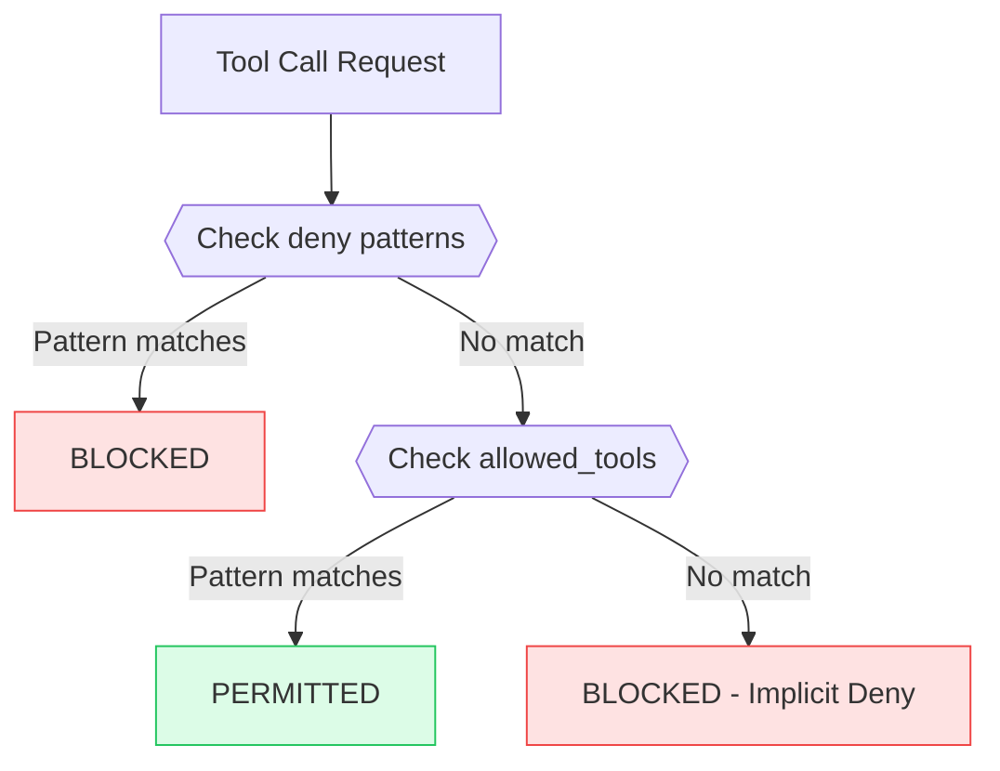
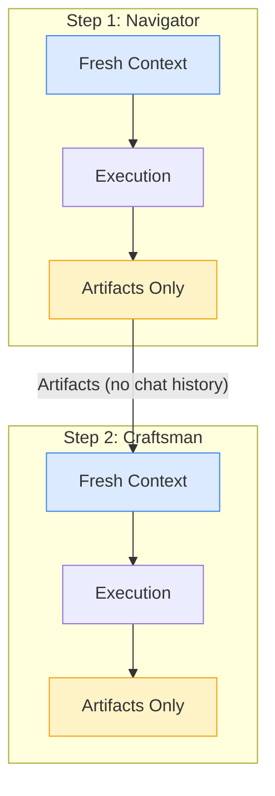
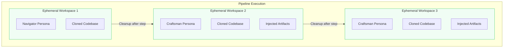

# Personas

A persona is a specialized AI agent with specific permissions and behavior. Personas control what an AI can see, do, and how it responds. They are fundamental to Wave's security model, enforcing separation of concerns and preventing unintended actions.

## Overview

Personas serve three critical functions in Wave:

1. **Permission Enforcement** - Control which tools and files an AI can access
2. **Behavior Customization** - Define how the AI approaches tasks via system prompts
3. **Security Isolation** - Prevent cross-contamination between pipeline steps

```yaml
personas:
  navigator:
    adapter: claude
    system_prompt_file: .wave/personas/navigator.md
    temperature: 0.1
    permissions:
      allowed_tools: ["Read", "Glob", "Grep"]
      deny: ["Write(*)", "Edit(*)"]
```

## Built-in Personas

Wave includes **13 built-in personas** designed for secure, specialized execution. The following table highlights three core personas commonly used in pipelines:

<script setup>
const builtInPersonas = [
  {
    persona: 'navigator',
    description: 'Read-only codebase explorer, produces navigation context and analysis',
    permissions: { read: 'allow', write: 'deny', execute: 'deny', network: 'deny' }
  },
  {
    persona: 'reviewer',
    description: 'Security and code review, read-only analysis with detailed reporting',
    permissions: { read: 'allow', write: 'deny', execute: 'deny', network: 'deny' }
  },
  {
    persona: 'craftsman',
    description: 'Full implementation and testing with scoped write and execute access',
    permissions: { read: 'allow', write: 'conditional', execute: 'conditional', network: 'deny' }
  }
]
</script>

<PermissionMatrix :personas="builtInPersonas" :showLegend="true" />

### Navigator

The Navigator is a read-only codebase explorer. It produces navigation context without modifying any files.

```yaml
personas:
  navigator:
    adapter: claude
    system_prompt_file: .wave/personas/navigator.md
    temperature: 0.1
    permissions:
      allowed_tools: ["Read", "Glob", "Grep"]
      deny: ["Write(*)", "Edit(*)", "Bash(*)"]
```

**Use cases:**
- Codebase analysis and understanding
- Architecture documentation generation
- Finding relevant code for implementation tasks
- Creating navigation context for downstream steps

### Reviewer

The Reviewer performs security and code review analysis. It has read-only access to analyze code quality and security issues.

```yaml
personas:
  reviewer:
    adapter: claude
    system_prompt_file: .wave/personas/reviewer.md
    temperature: 0.2
    permissions:
      allowed_tools: ["Read", "Glob", "Grep"]
      deny: ["Write(*)", "Edit(*)", "Bash(*)"]
```

**Use cases:**
- Security vulnerability analysis
- Code quality assessment
- Compliance checking
- Review of proposed changes

### Craftsman

The Craftsman handles implementation, testing, and code changes with full scoped access. It combines write and execute permissions for end-to-end feature delivery.

```yaml
personas:
  craftsman:
    adapter: claude
    system_prompt_file: .wave/personas/craftsman.md
    temperature: 0.3
    permissions:
      allowed_tools:
        - "Read"
        - "Glob"
        - "Grep"
        - "Write(src/*)"
        - "Write(*_test.go)"
        - "Edit(src/*)"
        - "Bash(go test*)"
        - "Bash(go build*)"
      deny:
        - "Write(*.env)"
        - "Bash(rm -rf *)"
```

**Use cases:**
- Feature implementation with tests
- Bug fixes with regression tests
- Code refactoring
- End-to-end delivery tasks

## Permission Model

Wave's permission system uses a **deny-first evaluation** model. This means all actions are denied by default unless explicitly allowed.

### Evaluation Order



1. **Check deny patterns** - If any `deny` pattern matches, the action is blocked immediately
2. **Check allowed_tools** - If any `allowed_tools` pattern matches, the action is permitted
3. **Implicit deny** - If no pattern matches, the action is blocked (default deny)

### Permission Patterns

Permissions use glob patterns to control tool access:

```yaml
permissions:
  allowed_tools:
    - "Read"                    # All Read calls allowed
    - "Write(src/*.ts)"         # Write to TypeScript files in src/
    - "Write(docs/**/*.md)"     # Write to markdown files anywhere in docs/
    - "Bash(npm test*)"         # Only npm test commands
    - "Bash(go build ./...)"    # Specific go build command
  deny:
    - "Write(*.env)"            # Never write env files
    - "Write(**/.env*)"         # Block .env files anywhere
    - "Bash(rm -rf *)"          # Block destructive commands
    - "Bash(*secret*)"          # Block commands with 'secret'
```

### Pattern Syntax

| Pattern | Description | Example |
|---------|-------------|---------|
| `Tool` | Allow all calls to tool | `Read` - allows all reads |
| `Tool(path)` | Allow specific path | `Write(src/main.go)` |
| `Tool(path/*)` | Allow files in directory | `Write(src/*)` |
| `Tool(path/**)` | Allow recursive directory | `Write(src/**)` |
| `Tool(*pattern*)` | Wildcard matching | `Bash(*test*)` |

## Fresh Memory at Step Boundaries

A critical security feature of Wave is **fresh memory at every step boundary**. Each pipeline step starts with a clean context:



### What This Means

- **No chat history inheritance** - Each step cannot see previous conversations
- **Artifact-only communication** - Steps communicate through explicit artifacts
- **Clean context** - Each persona starts fresh with only:
  - Its system prompt
  - Injected artifacts from dependencies
  - The current step's prompt

### Why Fresh Memory Matters

1. **Security** - Prevents prompt injection from propagating across steps
2. **Reliability** - Each step behaves consistently regardless of previous execution
3. **Audit trail** - All inter-step communication is explicit and logged
4. **Isolation** - A compromised step cannot influence future steps via memory

## Workspace Isolation

Each pipeline step executes in an **ephemeral workspace** - an isolated filesystem environment:



### Workspace Features

- **Fresh clone** - Each step gets a fresh copy of the codebase
- **Isolated filesystem** - Changes in one workspace don't affect others
- **Automatic cleanup** - Workspaces are destroyed after step completion
- **Artifact extraction** - Only declared outputs are preserved
- **No cross-contamination** - File modifications cannot leak between steps

### Workspace Configuration

```yaml
workspace:
  type: ephemeral          # Always isolated
  clone_depth: 1           # Shallow clone for speed
  preserve_on_failure: true # Keep workspace for debugging
```

## Using Personas in Pipelines

Reference personas by name in pipeline steps:

```yaml
pipelines:
  code-review:
    description: "Review and improve code quality"
    steps:
      - id: analyze
        persona: navigator
        exec:
          type: prompt
          source: "Analyze the codebase structure and identify areas for improvement"
        outputs:
          - analysis.md

      - id: review
        persona: reviewer
        dependencies: [analyze]
        inputs:
          - from: analyze
            artifact: analysis.md
        exec:
          type: prompt
          source: "Review the analysis and identify security concerns"

      - id: implement
        persona: craftsman
        dependencies: [review]
        exec:
          type: prompt
          source: "Implement the suggested improvements"
```

## Next Steps

- [Custom Personas Guide](/guides/custom-personas) - Create specialized personas for your workflows
- [Pipelines](/concepts/pipelines) - Use personas in multi-step workflows
- [Contracts](/concepts/contracts) - Validate persona outputs
- [Workspaces](/concepts/workspaces) - Understand workspace isolation
- [Manifest Reference](/reference/manifest) - Complete persona configuration options
