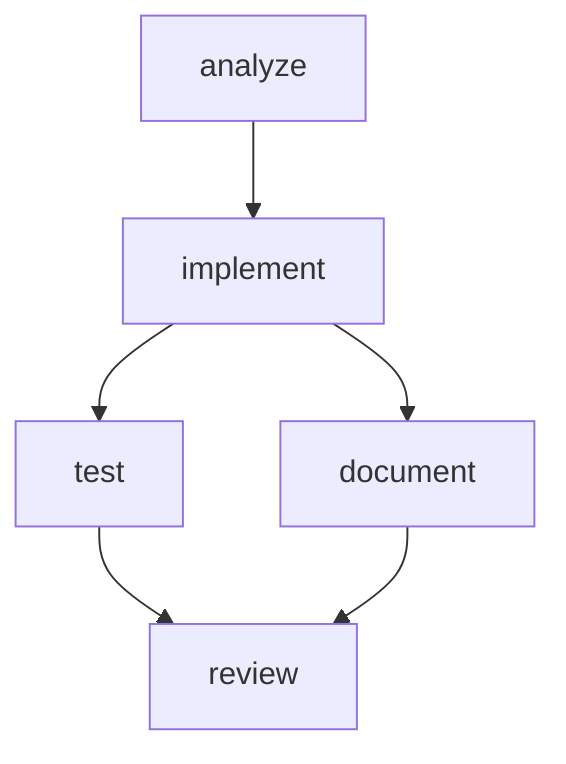

# Pipeline Execution: From Declaration to Results

Wave transforms declarative configuration into orchestrated AI workflow execution, following Infrastructure-as-Code principles where you specify **what** should happen and Wave handles **how** it happens.

## Execution Philosophy

Like Infrastructure-as-Code tools, Wave separates **intent** (your configuration) from **implementation** (how Wave executes it):

- **Docker Compose**: You declare services and dependencies → Docker orchestrates container lifecycle
- **Terraform**: You declare infrastructure state → Terraform manages resource provisioning
- **Kubernetes**: You declare desired state → Kubernetes maintains pod orchestration
- **Wave**: You declare AI workflows → Wave orchestrates persona execution and artifact flow

## From Configuration to Execution

### 1. Configuration Parsing and Validation

Wave starts by parsing your declarative configuration and validating it against the schema:

```yaml
# wave.yaml - Your declarative intent
pipeline:
  name: feature-development
  steps:
    - id: analyze
      persona: navigator
      task: "Analyze codebase for implementing {feature}"
      artifacts: ["codebase-scan"]

    - id: implement
      persona: craftsman
      dependencies: [analyze]
      task: "Implement feature based on analysis"
      handover:
        contract:
          type: json_schema
          schema: .wave/contracts/implementation.schema.json
```

**Wave validates:**
- Syntax correctness (valid YAML/JSON)
- Schema compliance (required fields, types)
- Dependency resolution (no cycles, valid references)
- Resource availability (personas exist, contracts are accessible)

### 2. Dependency Graph Construction

Wave builds an execution graph from your step dependencies:



**Graph analysis includes:**
- Topological sorting for execution order
- Parallel execution opportunity identification
- Critical path analysis for optimization
- Cycle detection and prevention

### 3. Workspace Provisioning

For each step, Wave creates an isolated execution environment:

```bash
# Wave creates ephemeral workspace
/tmp/wave-workspaces/pipeline-123/step-analyze/
├── input/          # Injected artifacts from dependencies
├── workspace/      # Working directory for AI persona
└── output/         # Generated artifacts for handover
```

**Workspace isolation ensures:**
- Fresh memory at every step boundary
- No contamination between steps
- Reproducible execution environments
- Secure artifact exchange

### 4. Persona Initialization

Wave launches the appropriate AI persona with:

```bash
# Wave executes (conceptually)
claude-code \
  --persona=.wave/personas/navigator.yaml \
  --workspace=/tmp/wave-workspaces/pipeline-123/step-analyze/ \
  --task="Analyze codebase for implementing authentication"
```

**Persona execution includes:**
- System prompt injection from persona configuration
- Permission enforcement (allow/deny patterns)
- Tool availability based on persona capabilities
- Fresh conversation context (no memory inheritance)

### 5. Artifact Flow Management

Wave manages data flow between steps through artifact injection:

```yaml
# Step configuration
- id: implement
  dependencies: [analyze]
  inputs: ["analysis-report", "file-list"]
```

**Wave automatically:**
- Locates artifacts from dependency steps
- Injects them into the new step's workspace
- Updates persona context with artifact descriptions
- Validates artifact formats before injection

### 6. Contract Validation

At step completion, Wave validates outputs against declared contracts:

```yaml
handover:
  contract:
    type: json_schema
    schema: .wave/contracts/implementation.schema.json
    source: output/implementation.json
    on_failure: retry
    max_retries: 2
```

**Validation process:**
- Extract output from specified source location
- Apply contract validation (schema, compilation, tests)
- On success: mark step complete, prepare artifacts for handover
- On failure: retry step with fresh workspace (if configured)

### 7. State Persistence

Wave maintains execution state in SQLite for resumption and monitoring:

```sql
-- Pipeline execution tracking
INSERT INTO pipeline_executions (id, config_hash, status, started_at);
INSERT INTO step_executions (pipeline_id, step_id, status, workspace_path);
INSERT INTO artifacts (step_id, name, path, checksum);
```

**State management enables:**
- Pipeline resumption after interruption
- Progress monitoring and observability
- Audit trails for compliance
- Rollback and recovery capabilities

## Execution Patterns

### Sequential Execution

When steps have linear dependencies:

```yaml
steps:
  - id: analyze      # Runs first
  - id: implement    # Waits for analyze
    dependencies: [analyze]
  - id: test         # Waits for implement
    dependencies: [implement]
```

Wave executes steps one after another, ensuring each completes successfully before starting the next.

### Parallel Execution

When steps can run independently:

```yaml
steps:
  - id: analyze      # Runs first
  - id: implement-backend  # Both start after analyze
    dependencies: [analyze]
  - id: implement-frontend # Both start after analyze
    dependencies: [analyze]
  - id: integrate    # Waits for both implementations
    dependencies: [implement-backend, implement-frontend]
```

Wave identifies parallelizable steps and executes them concurrently for optimal performance.

### Fan-out/Fan-in

When one step produces inputs for multiple steps, then results converge:

```yaml
steps:
  - id: requirements-analysis

  - id: backend-design
    dependencies: [requirements-analysis]
  - id: frontend-design
    dependencies: [requirements-analysis]
  - id: database-design
    dependencies: [requirements-analysis]

  - id: integration-plan
    dependencies: [backend-design, frontend-design, database-design]
```

Common pattern for complex workflows where analysis branches into specialized work that later integrates.

## Error Handling and Recovery

### Step Failure Recovery

When a step fails, Wave applies configured failure handling:

```yaml
handover:
  contract:
    on_failure: retry    # Options: retry, halt
    max_retries: 3
```

**Retry behavior:**
- Create fresh workspace (no contamination from failed attempt)
- Re-execute step with same inputs
- Exponential backoff between retries
- After max_retries, transition to failed state

### Pipeline Resumption

Wave can resume interrupted pipelines:

```bash
# Pipeline interrupted during execution
wave run feature-development  # Starts from beginning

# Resume from last successful checkpoint
wave run feature-development --resume
```

**Resumption logic:**
- Identify last successful step from state database
- Skip completed steps (artifacts already available)
- Resume from next pending step
- Maintain full audit trail of resumption

### Rollback Capabilities

For critical failures, Wave supports controlled rollback:

```bash
# Rollback to previous successful state
wave rollback pipeline-123 --to-step=analyze

# Clean rollback (removes failed artifacts)
wave rollback pipeline-123 --clean
```

## Observability and Monitoring

### Real-time Progress Events

Wave emits structured events for monitoring:

```json
{
  "event": "step_started",
  "pipeline_id": "pipeline-123",
  "step_id": "analyze",
  "timestamp": "2025-01-15T10:30:00Z",
  "workspace": "/tmp/wave-workspaces/pipeline-123/step-analyze"
}
```

**Event types:**
- `pipeline_started`, `pipeline_completed`, `pipeline_failed`
- `step_started`, `step_completed`, `step_failed`, `step_retried`
- `contract_validated`, `contract_failed`
- `artifact_created`, `artifact_injected`

### Execution Traces

Wave generates detailed execution traces for debugging:

```bash
# View execution trace
wave trace pipeline-123

# Pipeline: feature-development (pipeline-123)
# Status: completed
# Duration: 8m 32s
#
# Steps:
# ✓ analyze      (2m 15s) - artifacts: [analysis-report.json, file-list.txt]
# ✓ implement   (5m 10s) - artifacts: [implementation.js, tests.spec.js]
# ✓ review      (1m 7s)  - artifacts: [review-report.md]
```

### Audit Logging

All execution details are logged for compliance:

```bash
# View audit logs
wave audit pipeline-123

# [2025-01-15 10:30:00] STEP_START: analyze (persona=navigator, workspace=/tmp/...)
# [2025-01-15 10:30:01] TOOL_CALL: file_read(/src/auth.js)
# [2025-01-15 10:32:15] CONTRACT_PASS: analysis-report.json validated against schema
# [2025-01-15 10:32:15] STEP_COMPLETE: analyze (duration=2m15s)
```

## Performance Optimizations

### Workspace Management

- **Lazy cleanup**: Workspaces persist until disk pressure
- **Artifact caching**: Reuse validated artifacts across pipeline runs
- **Parallel workspace creation**: Pre-provision workspaces for upcoming steps

### Contract Optimization

- **Schema compilation**: Pre-compile JSON schemas for faster validation
- **Incremental validation**: Only validate changed artifacts
- **Validation caching**: Cache successful validations by content hash

### State Database Performance

- **Connection pooling**: Manage concurrent state access
- **Prepared statements**: Pre-compile frequent queries
- **Index optimization**: Optimize for common query patterns

## Integration with Development Workflows

### CI/CD Integration

```yaml
# .github/workflows/wave-pipeline.yml
name: Wave AI Pipeline
on: [push, pull_request]

jobs:
  ai-workflow:
    runs-on: ubuntu-latest
    steps:
    - uses: actions/checkout@v4
    - name: Run Wave Pipeline
      run: |
        wave run code-review \
          --feature="${{ github.event.head_commit.message }}" \
          --output-format=github-comment
```

### Local Development

```bash
# Quick iteration cycle
wave run feature-development --watch
# Re-runs pipeline when wave.yaml changes

# Debug mode with verbose output
wave run feature-development --debug
# Shows detailed execution traces in real-time
```

Pipeline execution in Wave brings Infrastructure-as-Code reliability to AI workflows: predictable, observable, and reproducible execution that scales from individual development to enterprise team adoption.

## Related Concepts

- [AI as Code](/paradigm/ai-as-code) - The Infrastructure-as-Code paradigm applied to AI
- [Contracts](/concepts/contracts) - Quality gates that ensure reliable step handovers
- [Workspaces](/concepts/workspaces) - Isolated execution environments for reproducibility