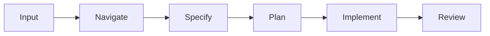
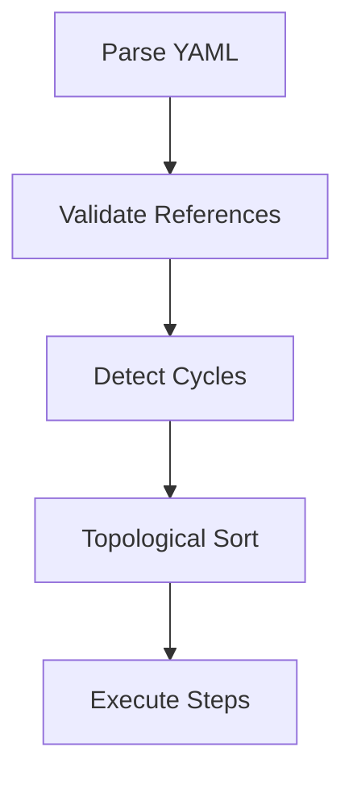
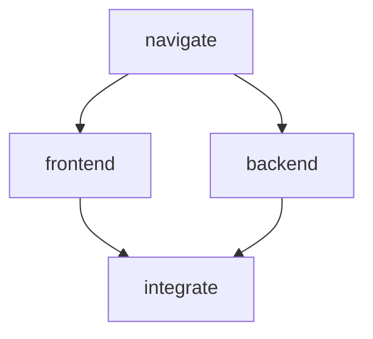

# Pipelines

Pipelines are the core execution model of Wave. A pipeline is a **Directed Acyclic Graph (DAG)** of steps, where each step runs one persona in one ephemeral workspace.

## How Pipelines Work



Each arrow represents a dependency — a step only starts after all its dependencies complete. Steps without mutual dependencies can run in parallel.

## Pipeline File Format

Pipeline files are YAML documents stored in `.wave/pipelines/` by convention:

```yaml
kind: WavePipeline
metadata:
  name: speckit-flow
  description: "Specification-driven development"

steps:
  - id: navigate
    persona: navigator
    memory:
      strategy: fresh
    exec:
      type: prompt
      source: "Analyze the codebase for: {{ input }}"

  - id: implement
    persona: craftsman
    dependencies: [navigate]
    memory:
      strategy: fresh
      inject_artifacts:
        - step: navigate
          artifact: analysis
          as: context
    exec:
      type: prompt
      source: "Implement based on the analysis."
    handover:
      contract:
        type: test_suite
        command: "go test ./..."
        must_pass: true
```

## DAG Resolution

When a pipeline starts, Wave:

1. **Parses** the YAML step list.
2. **Validates** all references (personas exist in manifest, dependency IDs exist).
3. **Detects cycles** — circular dependencies are rejected immediately.
4. **Topologically sorts** steps into execution order.
5. **Identifies parallelism** — independent steps may execute concurrently.



## Step Execution Loop

For each step in execution order:

1. **Create workspace** — ephemeral directory under `runtime.workspace_root`.
2. **Inject artifacts** — copy outputs from dependency steps into workspace.
3. **Bind persona** — load system prompt, permissions, hooks, temperature.
4. **Invoke adapter** — spawn subprocess (e.g., `claude -p "prompt"`).
5. **Monitor** — track timeout and relay threshold.
6. **Validate contract** — check output against handover contract.
7. **Persist state** — save step state to SQLite.
8. **Emit event** — structured NDJSON progress event to stdout.

## Step State Machine

```
Pending ──→ Running ──→ Completed
                ├──→ Retrying ──→ Running
                └──→ Failed
```

| State | Description | Resumable |
|-------|-------------|-----------|
| `pending` | Queued, waiting for dependencies | yes |
| `running` | Actively executing | no |
| `completed` | Finished successfully | no (skip) |
| `retrying` | Failed, attempting retry | automatic |
| `failed` | Exceeded max retries | yes |

## Artifact Flow

Artifacts are the primary communication mechanism between steps. Each step:

- **Receives** injected artifacts from its dependencies.
- **Produces** output artifacts declared in `output_artifacts`.
- **Validates** outputs against handover contracts.

```yaml
# Step A produces an artifact
output_artifacts:
  - name: analysis
    path: output/analysis.json

# Step B consumes that artifact
memory:
  inject_artifacts:
    - step: step-a
      artifact: analysis
      as: prior_analysis
```

Artifacts are files or directories in the step's workspace. They are **copied** (not linked) into dependent steps to maintain workspace isolation.

## Parallelism

Steps without mutual dependencies execute in parallel, up to `runtime.max_concurrent_workers`:

```yaml
steps:
  - id: navigate
    # ... (no dependencies — runs first)

  - id: frontend
    dependencies: [navigate]  # These two run in parallel
    # ...

  - id: backend
    dependencies: [navigate]  # These two run in parallel
    # ...

  - id: integrate
    dependencies: [frontend, backend]  # Waits for both
    # ...
```



## Failure Handling

When a step fails (contract violation, crash, timeout):

1. Step transitions to `retrying`.
2. Retry with exponential backoff.
3. Fresh workspace, full retry budget.
4. If max retries exceeded → `failed` → pipeline halts.

```yaml
handover:
  contract:
    on_failure: retry     # or "halt"
    max_retries: 3
```

## Further Reading

- [Pipeline Schema Reference](/reference/pipeline-schema) — complete field reference
- [Matrix Strategies](/guides/matrix-strategies) — parallel fan-out execution
- [State & Resumption](/guides/state-resumption) — persisting and resuming pipelines
- [Contracts](/concepts/contracts) — handover validation
