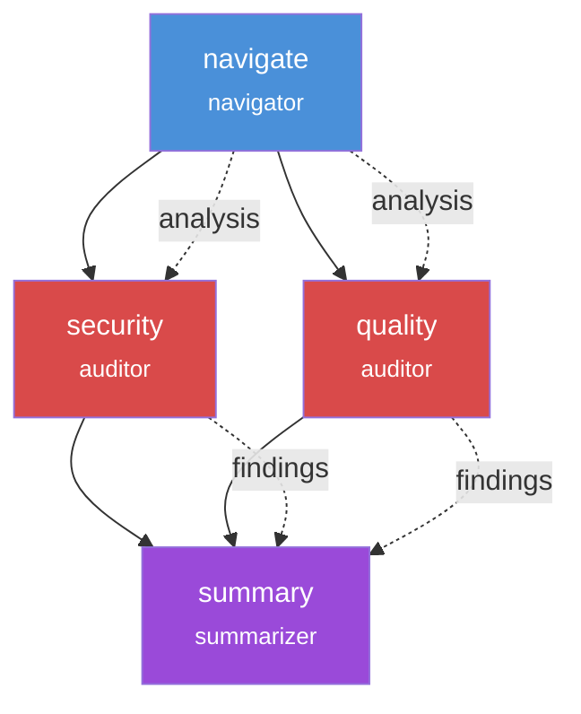
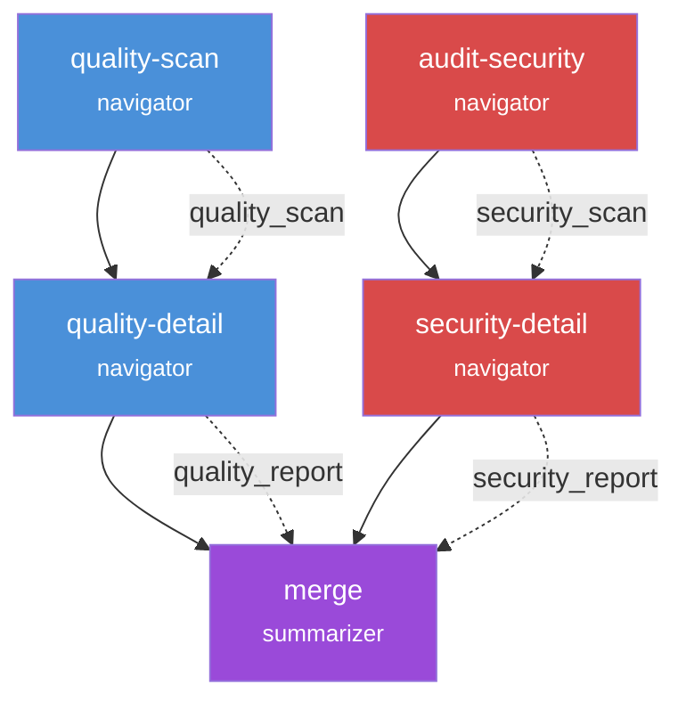

# Pipelines

A pipeline is a multi-step AI workflow where each step runs one persona in an isolated workspace. Pipelines enable complex AI workflows by breaking tasks into focused steps with clear boundaries.

<div v-pre>

```yaml
kind: WavePipeline
metadata:
  name: ops-pr-review
steps:
  - id: analyze
    persona: navigator
    exec:
      type: prompt
      source: "Analyze: {{ input }}"
```

</div>

Use pipelines when you need coordinated AI tasks that build on each other's outputs.

## Pipeline Structure

Every pipeline has three main sections:

| Section | Purpose |
|---------|---------|
| `metadata` | Name, description, and pipeline identity |
| `input` | How the pipeline receives its input |
| `steps` | The sequence of AI tasks to execute |

## Dependency Patterns

### Linear Dependencies

Steps execute in sequence when dependencies are specified:

<div v-pre>

```yaml
steps:
  - id: analyze
    persona: navigator
    exec:
      type: prompt
      source: "Analyze the codebase for: {{ input }}"
    output_artifacts:
      - name: analysis
        path: .agents/output/analysis.json

  - id: implement
    persona: craftsman
    dependencies: [analyze]
    memory:
      strategy: fresh
      inject_artifacts:
        - step: analyze
          artifact: analysis
          as: context
    exec:
      type: prompt
      source: "Implement based on the analysis."
```

</div>

### Parallel Execution (Fan-Out)

Steps without mutual dependencies run in parallel. This pattern is useful when you need multiple perspectives on the same input:

<div v-pre>

```yaml
steps:
  - id: navigate
    persona: navigator
    exec:
      type: prompt
      source: "Analyze: {{ input }}"
    output_artifacts:
      - name: analysis
        path: .agents/output/analysis.json
        type: json

  - id: security
    persona: auditor
    dependencies: [navigate]
    memory:
      strategy: fresh
      inject_artifacts:
        - step: navigate
          artifact: analysis
          as: context
    exec:
      type: prompt
      source: "Security review"
    output_artifacts:
      - name: findings
        path: .agents/output/security.md
        type: markdown

  - id: quality
    persona: auditor
    dependencies: [navigate]
    memory:
      strategy: fresh
      inject_artifacts:
        - step: navigate
          artifact: analysis
          as: context
    exec:
      type: prompt
      source: "Quality review"
    output_artifacts:
      - name: findings
        path: .agents/output/quality.md
        type: markdown
```

</div>

In this example, `security` and `quality` run in parallel after `navigate` completes.

### Convergence (Fan-In)

Multiple parallel steps can feed into a single summary step:

```yaml
steps:
  # ... parallel steps above ...

  - id: summary
    persona: summarizer
    dependencies: [security, quality]
    memory:
      strategy: fresh
      inject_artifacts:
        - step: security
          artifact: findings
          as: security_report
        - step: quality
          artifact: findings
          as: quality_report
    exec:
      type: prompt
      source: "Synthesize all findings into a final report"
```

### Independent Parallel Tracks

When two or more step sequences have no shared upstream dependency, they run as fully independent parallel tracks from the start. This is distinct from fan-out, where parallel steps share a common ancestor. Independent tracks converge only at a final merge step:

<div v-pre>

```yaml
steps:
  # Track A — starts immediately
  - id: quality-scan
    persona: navigator
    exec:
      type: prompt
      source: "Scan for code quality issues: {{ input }}"
    output_artifacts:
      - name: quality_scan
        path: .agents/output/quality-scan.json
        type: json

  - id: quality-detail
    persona: navigator
    dependencies: [quality-scan]
    memory:
      strategy: fresh
      inject_artifacts:
        - step: quality-scan
          artifact: quality_scan
          as: scan_results
    exec:
      type: prompt
      source: "Deepen the quality analysis"
    output_artifacts:
      - name: quality_report
        path: .agents/output/quality-detail.md
        type: markdown

  # Track B — starts immediately (no dependency on Track A)
  - id: audit-security
    persona: navigator
    exec:
      type: prompt
      source: "Scan for security vulnerabilities: {{ input }}"
    output_artifacts:
      - name: security_scan
        path: .agents/output/audit-security.json
        type: json

  - id: security-detail
    persona: navigator
    dependencies: [audit-security]
    memory:
      strategy: fresh
      inject_artifacts:
        - step: audit-security
          artifact: security_scan
          as: scan_results
    exec:
      type: prompt
      source: "Deepen the security analysis"
    output_artifacts:
      - name: security_report
        path: .agents/output/security-detail.md
        type: markdown

  # Merge — converges both tracks
  - id: merge
    persona: summarizer
    dependencies: [quality-detail, security-detail]
    memory:
      strategy: fresh
      inject_artifacts:
        - step: quality-detail
          artifact: quality_report
          as: quality_findings
        - step: security-detail
          artifact: security_report
          as: security_findings
    exec:
      type: prompt
      source: "Synthesize quality and security findings"
```

</div>

In this example, Track A (`quality-scan` → `quality-detail`) and Track B (`audit-security` → `security-detail`) run simultaneously from the start. The `merge` step waits for both tracks to complete before synthesizing results.

> See `.agents/pipelines/dual-analysis.yaml` for a complete working example of this pattern.

### Dependency Visualization

The following diagram shows how dependencies create the execution flow:


```mermaid
flowchart TD
  navigate[navigate<br/><small>navigator</small>]
  security[security<br/><small>auditor</small>]
  quality[quality<br/><small>auditor</small>]
  summary[summary<br/><small>summarizer</small>]

  navigate --> security
  navigate --> quality
  security --> summary
  quality --> summary

  navigate -.->|"analysis"| security
  navigate -.->|"analysis"| quality
  security -.->|"findings"| summary
  quality -.->|"findings"| summary

  style navigate fill:#4a90d9,color:#fff
  style security fill:#d94a4a,color:#fff
  style quality fill:#d94a4a,color:#fff
  style summary fill:#9a4ad9,color:#fff
```

The independent parallel tracks pattern creates a different topology — two tracks with no shared ancestor:


```mermaid
flowchart TD
  qs[quality-scan<br/><small>navigator</small>]
  qd[quality-detail<br/><small>navigator</small>]
  ss[audit-security<br/><small>navigator</small>]
  sd[security-detail<br/><small>navigator</small>]
  merge[merge<br/><small>summarizer</small>]

  qs --> qd
  ss --> sd
  qd --> merge
  sd --> merge

  qs -.->|"quality_scan"| qd
  ss -.->|"security_scan"| sd
  qd -.->|"quality_report"| merge
  sd -.->|"security_report"| merge

  style qs fill:#4a90d9,color:#fff
  style qd fill:#4a90d9,color:#fff
  style ss fill:#d94a4a,color:#fff
  style sd fill:#d94a4a,color:#fff
  style merge fill:#9a4ad9,color:#fff
```

## Verifying Parallel Execution

Wave provides several ways to confirm that steps executed concurrently rather than sequentially.

### Audit Logs

Each pipeline run produces timestamped events in `.agents/traces/`. Look for `STEP_START` and `STEP_END` entries with RFC 3339 timestamps:

```
2026-01-15T10:00:01.123Z  STEP_START  quality-scan
2026-01-15T10:00:01.456Z  STEP_START  audit-security    ← started ~300ms later
2026-01-15T10:00:15.789Z  STEP_END    quality-scan
2026-01-15T10:00:18.234Z  STEP_END    audit-security
2026-01-15T10:00:18.567Z  STEP_START  merge             ← started after both ended
```

Overlapping `STEP_START`/`STEP_END` intervals prove the steps ran concurrently. If `audit-security` started before `quality-scan` ended, they were running in parallel.

### Status Display

The `wave status` command shows per-step elapsed timers. When steps run concurrently, you will see multiple steps in `running` state simultaneously:

```bash
wave status <run-id>
```

### JSON Logs

For machine-parseable verification, use JSON-formatted logs:

```bash
wave logs --format json <run-id>
```

Each event includes a nanosecond-precision timestamp. Compare `step_start` times across independent steps — timestamps within the same second confirm concurrent scheduling by the DAG executor.

## Artifact Patterns

Artifacts are the primary mechanism for passing data between steps.

### Producing Artifacts

Declare what a step outputs:

```yaml
output_artifacts:
  - name: analysis        # Artifact identifier
    path: .agents/output/data.json  # Where the step writes it
    type: json             # Type hint for consumers
```

### Consuming Artifacts

Inject artifacts from previous steps:

```yaml
memory:
  strategy: fresh
  inject_artifacts:
    - step: analyze      # Source step
      artifact: analysis  # Artifact name
      as: context         # Mount name in workspace
```

The artifact appears at `.agents/artifacts/<as-name>` in the step's workspace.

### Artifact Types

| Type | Description | Best For |
|------|-------------|----------|
| `json` | Structured data | Analysis results, configs |
| `markdown` | Formatted text | Reports, documentation |
| `file` | Single file | Code, configs |
| `directory` | Folder | Multiple files, assets |

### Multi-Artifact Injection

A step can consume multiple artifacts:

```yaml
memory:
  strategy: fresh
  inject_artifacts:
    - step: analyze
      artifact: code_analysis
      as: code
    - step: security
      artifact: findings
      as: security
    - step: quality
      artifact: findings
      as: quality
```

All artifacts are available under `.agents/artifacts/`:
- `.agents/artifacts/code`
- `.agents/artifacts/security`
- `.agents/artifacts/quality`

## Memory Strategies

Control how context flows between steps:

| Strategy | Behavior | Use When |
|----------|----------|----------|
| `fresh` | Clean slate, only injected artifacts | Most cases (recommended) |
| `inherit` | Carry forward previous context | Continuation tasks |

Fresh memory is recommended to prevent context pollution and ensure reproducible results.

## Outcomes

Outcomes extract structured results — such as PR URLs, issue links, or deployment URLs — from step artifacts into the pipeline output summary. Declare outcomes on any step that produces a JSON artifact containing values you want to surface.

```yaml
steps:
  - id: create-pr
    persona: craftsman
    exec:
      type: prompt
      source: "Create a pull request"
    output_artifacts:
      - name: result
        path: .agents/output/result.json
        type: json
    outcomes:
      - type: pr
        extract_from: .agents/output/result.json
        json_path: ".pr_url"
        label: "Pull Request"
```

Supported outcome types: `pr`, `issue`, `url`, `deployment`. See [Outcomes](/concepts/outcomes) for array extraction, field reference, and advanced examples.

## Running Pipelines

Execute a pipeline with input:

```bash
wave run ops-pr-review "Review authentication changes"
```

Check pipeline status:

```bash
wave status ops-pr-review
```

View artifacts from a run:

```bash
wave artifacts <run-id>
```

## Complete Example

A production-ready code review pipeline:

<div v-pre>

```yaml
kind: WavePipeline
metadata:
  name: ops-pr-review
  description: "Multi-perspective code review with security and quality checks"

input:
  source: cli

steps:
  - id: diff-analysis
    persona: navigator
    workspace:
      mount:
        - source: ./
          target: /src
          mode: readonly
    exec:
      type: prompt
      source: |
        Analyze the changes: {{ input }}
        Output as JSON with files, modules, and breaking changes.
    output_artifacts:
      - name: diff
        path: .agents/output/diff.json
        type: json

  - id: security-review
    persona: auditor
    dependencies: [diff-analysis]
    memory:
      strategy: fresh
      inject_artifacts:
        - step: diff-analysis
          artifact: diff
          as: changes
    exec:
      type: prompt
      source: "Review .agents/artifacts/changes for security vulnerabilities"
    output_artifacts:
      - name: security
        path: .agents/output/security.md
        type: markdown

  - id: quality-review
    persona: auditor
    dependencies: [diff-analysis]
    memory:
      strategy: fresh
      inject_artifacts:
        - step: diff-analysis
          artifact: diff
          as: changes
    exec:
      type: prompt
      source: "Review .agents/artifacts/changes for code quality issues"
    output_artifacts:
      - name: quality
        path: .agents/output/quality.md
        type: markdown

  - id: final-verdict
    persona: summarizer
    dependencies: [security-review, quality-review]
    memory:
      strategy: fresh
      inject_artifacts:
        - step: security-review
          artifact: security
          as: security_findings
        - step: quality-review
          artifact: quality
          as: quality_findings
    exec:
      type: prompt
      source: |
        Synthesize findings into: APPROVE / REQUEST_CHANGES / NEEDS_DISCUSSION
    output_artifacts:
      - name: verdict
        path: .agents/output/verdict.md
        type: markdown
```

</div>

## Next Steps

- [Personas](/concepts/personas) - Configure the AI agents that run in each step
- [Outcomes](/concepts/outcomes) - Extract structured results from pipelines
- [Contracts](/concepts/contracts) - Validate step outputs before handover
- [Artifacts](/concepts/artifacts) - Deep dive into artifact passing
- [Pipeline Configuration Guide](/guides/pipeline-configuration) - Step-by-step configuration guide
- [Pipeline Schema Reference](/reference/pipeline-schema) - Complete field reference
