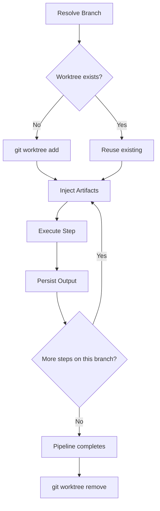

# Workspaces

Every pipeline step needs somewhere to run. Wave gives each pipeline a **workspace** — the directory where AI agents read code, write files, and produce artifacts.

## Git Worktrees: The Default

Wave uses **native git worktrees** as the default workspace strategy. Instead of copying your repository or mounting directories, Wave creates a real git checkout on a dedicated branch.

<div v-pre>

```yaml
steps:
  - id: analyze
    persona: navigator
    workspace:
      type: worktree
      branch: "{{ pipeline_id }}"
    exec:
      type: prompt
      source: "Analyze the codebase"
```

</div>

That's it. No mount configurations, no path mapping, no `cd` hacks. The step runs in your actual repository with full git capabilities.

### Workspaces Live Where Your Code Lives

The worktree is created inside your project at `.wave/workspaces/` — not in some detached `/tmp` folder or a central orchestration directory somewhere else on your machine. Your pipeline workspaces are part of your repo's directory tree, right next to the code they operate on. One `ls` and you see everything.

### One Branch, One Worktree

When multiple steps specify the same branch, they **share the same worktree**. Changes made by one step are immediately visible to the next.

```
.wave/workspaces/my-pipeline/__wt_my-pipeline/
├── .git              ← pointer to main repo's .git/worktrees/
├── src/              ← your full source tree
├── go.mod
├── output/           ← step artifacts accumulate here
└── ...               ← everything, just like your repo
```

This means a `plan` step can write analysis files that the `implement` step picks up directly — no artifact copying needed for files within the same worktree.

### Why Worktrees

| | Worktree | Mount | Detached Directory |
|---|---|---|---|
| Lives inside your repo | Yes | Yes | No |
| Full git history | Yes | Read-only | No |
| Branch & commit | Yes | No | No |
| Steps share filesystem | Yes | No | No |
| Zero copy overhead | Yes | No | No |
| Works with any git tool | Yes | Partial | No |
| Automatic cleanup | Yes | Manual | Manual |

### Lifecycle



1. **Resolve** — The branch name is resolved from template variables (typically `{{ pipeline_id }}`).
2. **Create or Reuse** — If no worktree exists for this branch, `git worktree add` creates one. Otherwise, the existing worktree is reused.
3. **Inject** — Artifacts from completed dependency steps are copied in.
4. **Execute** — The adapter subprocess runs with the worktree as its working directory.
5. **Persist** — Output artifacts are stored for downstream steps.
6. **Cleanup** — When the pipeline completes (or fails), the worktree is removed automatically.

### Verification

While a pipeline is running, you can confirm worktree usage:

```bash
# List active worktrees
git worktree list

# Check the workspace — .git should be a file, not a directory
cat .wave/workspaces/<pipeline-id>/__wt_<branch>/.git
# → gitdir: /your/repo/.git/worktrees/...
```

## Mount Workspaces

For read-only analysis or when you need fine-grained access control, mount workspaces give you explicit control over which directories a step can see.

```yaml
workspace:
  mount:
    - source: ./src
      target: /code
      mode: readonly
    - source: ./output
      target: /out
      mode: readwrite
```

### Access Modes

| Mode | Description |
|------|-------------|
| `readonly` | Step can read but not modify. Default for source code mounts. |
| `readwrite` | Step can read and modify. Use for output directories. |

Mount workspaces create an isolated directory structure under `.wave/workspaces/<pipeline-id>/<step-id>/` with symlinks or copies of the specified sources.

## Choosing a Strategy

**Use worktrees** (the default) when your pipeline needs to:
- Read and modify source code
- Create branches, commits, or pull requests
- Share file changes between steps
- Run build tools that expect a git repository

**Use mounts** when your pipeline needs to:
- Enforce strict read-only access to source code
- Expose only specific subdirectories to a step
- Run analysis without risk of modifying the repo

## Workspace Root

<div v-pre>

```yaml
# In wave.yaml
runtime:
  workspace_root: .wave/workspaces    # Default
```

</div>

All workspaces are created under this root. The directory structure is:

```
.wave/workspaces/
└── <pipeline-id>/
    ├── __wt_<branch>/       ← worktree workspace (shared across steps)
    ├── <step-id>/           ← mount workspace (per step)
    └── ...
```

## Debugging

Worktree workspaces are cleaned up when a pipeline completes. To inspect them, pause or catch a failure:

```bash
# Find the workspace while pipeline is running
ls .wave/workspaces/<pipeline-id>/

# Inspect what the agent saw
cat .wave/workspaces/<pipeline-id>/__wt_*/CLAUDE.md

# Check injected artifacts
ls .wave/workspaces/<pipeline-id>/__wt_*/artifacts/

# Look at step output
ls .wave/workspaces/<pipeline-id>/__wt_*/output/
```

## Further Reading

- [Pipeline Schema — WorkspaceConfig](/reference/pipeline-schema#workspace-configuration) — field reference
- [Pipelines](/concepts/pipelines) — how workspaces fit into the execution model
- [State & Resumption](/guides/state-resumption) — workspace persistence across resumes
