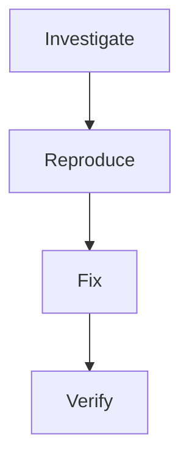

# Example: Hotfix Pipeline

A streamlined pipeline for investigating and fixing production issues quickly, with built-in verification.

## Overview

The hotfix pipeline is designed for speed. It skips the full specification phase and goes straight from investigation to fix, with a verification step to prevent regressions.



## Pipeline Definition

<div v-pre>

```yaml
kind: WavePipeline
metadata:
  name: hotfix
  description: "Quick investigation and fix for production issues"

input:
  source: cli

steps:
  - id: investigate
    persona: navigator
    memory:
      strategy: fresh
    workspace:
      mount:
        - source: ./
          target: /src
          mode: readonly
    exec:
      type: prompt
      source: |
        Investigate this production issue: {{ input }}

        1. Search for related code paths
        2. Check recent commits that may have introduced the bug
        3. Identify the root cause
        4. Assess blast radius (what else could be affected)

        Output structured findings as JSON:
        {
          "root_cause": "description",
          "affected_files": ["path1", "path2"],
          "recent_commits": ["hash1", "hash2"],
          "blast_radius": "assessment",
          "fix_approach": "recommended approach"
        }
    output_artifacts:
      - name: findings
        path: .wave/output/findings.json
        type: json
    handover:
      contract:
        type: json_schema
        schema_path: |
          {
            "type": "object",
            "required": ["root_cause", "affected_files", "fix_approach"],
            "properties": {
              "root_cause": {"type": "string", "minLength": 10},
              "affected_files": {"type": "array", "minItems": 1},
              "fix_approach": {"type": "string", "minLength": 10}
            }
          }
        source: .wave/output/findings.json
        on_failure: retry
        max_retries: 2

  - id: reproduce
    persona: craftsman
    dependencies: [investigate]
    memory:
      strategy: fresh
      inject_artifacts:
        - step: investigate
          artifact: findings
          as: investigation
    exec:
      type: command
      source: "go test -run 'Test.*Regression' -v -count=1"
    handover:
      contract:
        type: test_suite
        command: "echo 'Reproduction confirmed'"
        must_pass: true

  - id: fix
    persona: craftsman
    dependencies: [reproduce]
    memory:
      strategy: fresh
      inject_artifacts:
        - step: investigate
          artifact: findings
          as: investigation
    workspace:
      mount:
        - source: ./
          target: /src
          mode: readwrite
    exec:
      type: prompt
      source: |
        Fix the production issue based on the investigation findings.

        Requirements:
        1. Apply the minimal fix — don't refactor surrounding code
        2. Add a regression test that would have caught this bug
        3. Ensure all existing tests still pass
        4. Document the fix in a commit-ready message
    handover:
      contract:
        type: test_suite
        command: "go test ./... -count=1"
        must_pass: true
        on_failure: retry
        max_retries: 3

  - id: verify
    persona: auditor
    dependencies: [fix]
    memory:
      strategy: fresh
    exec:
      type: prompt
      source: |
        Verify the hotfix:

        1. Is the fix minimal and focused? (no unrelated changes)
        2. Does the regression test actually test the reported issue?
        3. Are there other code paths with the same vulnerability?
        4. Is the fix safe for production deployment?

        Output a go/no-go recommendation with reasoning.
    output_artifacts:
      - name: verdict
        path: .wave/output/verdict.md
        type: markdown
```

</div>

## Running the Hotfix Pipeline

```bash
# Investigate and fix
wave run hotfix \
  --input "Users receiving 500 error on login when email contains '+' character"

# Or use ad-hoc mode for simpler fixes
wave do "fix the login 500 error for emails with + character"
```

## When to Use Hotfix vs Spec Develop

| Scenario | Pipeline |
|----------|----------|
| Production bug, needs fast fix | **hotfix** |
| New feature development | speckit-flow |
| Security vulnerability | **hotfix** (with auditor persona) |
| Refactoring | speckit-flow |
| Quick typo/config fix | `wave do` (ad-hoc) |
