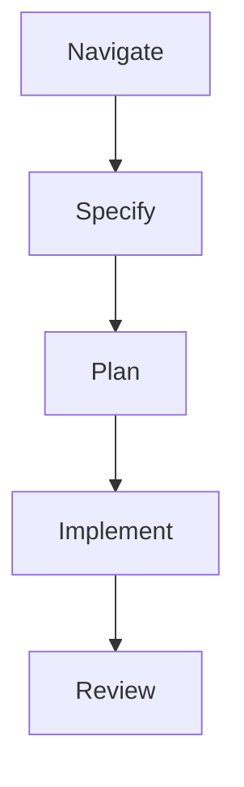

# Example: Speckit Flow Pipeline

A complete specification-driven development pipeline that takes a feature request through navigation, specification, planning, implementation, and review.

## Overview

The speckit flow is Wave's flagship pipeline pattern. It embodies the principle that **understanding precedes implementation** — every feature goes through structured analysis before code is written.



## Full Pipeline Definition

```yaml
kind: WavePipeline
metadata:
  name: speckit-flow
  description: "Specification-driven feature development"

input:
  source: cli

steps:
  - id: navigate
    persona: navigator
    memory:
      strategy: fresh
    workspace:
      mount:
        - source: ./
          target: /src
          mode: readonly
    exec:
      type: prompt
      source: |
        Analyze the codebase for: {{ input }}

        Find and report:
        1. Relevant source files and their purposes
        2. Existing patterns (naming, architecture, testing)
        3. Dependencies and integration points
        4. Potential impact areas

        Output as structured JSON with keys:
        files, patterns, dependencies, impact_areas
    output_artifacts:
      - name: analysis
        path: output/analysis.json
        type: json
    handover:
      contract:
        type: json_schema
        schema_path: .wave/contracts/navigation.schema.json
        source: output/analysis.json
        on_failure: retry
        max_retries: 2

  - id: specify
    persona: philosopher
    dependencies: [navigate]
    memory:
      strategy: fresh
      inject_artifacts:
        - step: navigate
          artifact: analysis
          as: navigation_report
    exec:
      type: prompt
      source: |
        Based on the navigation report, create a feature specification for: {{ input }}

        Include:
        1. User stories with acceptance criteria
        2. Data model changes
        3. API design (endpoints, request/response schemas)
        4. Edge cases and error handling
        5. Testing strategy
    output_artifacts:
      - name: spec
        path: output/spec.md
        type: markdown
    handover:
      contract:
        type: json_schema
        schema_path: .wave/contracts/specification.schema.json
        source: output/spec.json
        on_failure: retry
        max_retries: 2

  - id: plan
    persona: philosopher
    dependencies: [specify]
    memory:
      strategy: fresh
      inject_artifacts:
        - step: navigate
          artifact: analysis
          as: navigation_report
        - step: specify
          artifact: spec
          as: feature_spec
    exec:
      type: prompt
      source: |
        Create an implementation plan for the feature specification.

        Include:
        1. Ordered list of implementation steps
        2. File-by-file change descriptions
        3. Testing plan (unit, integration)
        4. Risk assessment
    output_artifacts:
      - name: plan
        path: output/plan.md
        type: markdown

  - id: implement
    persona: craftsman
    dependencies: [plan]
    memory:
      strategy: fresh
      inject_artifacts:
        - step: specify
          artifact: spec
          as: feature_spec
        - step: plan
          artifact: plan
          as: implementation_plan
    workspace:
      mount:
        - source: ./
          target: /src
          mode: readwrite
    exec:
      type: prompt
      source: |
        Implement the feature according to the plan.

        Follow the implementation plan step by step:
        1. Make code changes as specified
        2. Write tests for all new functionality
        3. Run existing tests to prevent regressions
        4. Document public APIs
    handover:
      contract:
        type: test_suite
        command: "go test ./..."
        must_pass: true
        on_failure: retry
        max_retries: 3
      compaction:
        trigger: "token_limit_80%"
        persona: summarizer

  - id: review
    persona: auditor
    dependencies: [implement]
    memory:
      strategy: fresh
    exec:
      type: prompt
      source: |
        Review the implementation for:

        Security:
        - SQL injection, XSS, CSRF vulnerabilities
        - Authentication/authorization gaps
        - Input validation completeness

        Quality:
        - Error handling coverage
        - Test coverage and quality
        - Code style consistency
        - Performance implications

        Output a structured review report with severity ratings.
    output_artifacts:
      - name: review
        path: output/review.md
        type: markdown
```

## Contract Schemas

### Navigation Contract

```json
// .wave/contracts/navigation.schema.json
{
  "$schema": "http://json-schema.org/draft-07/schema#",
  "type": "object",
  "required": ["files", "patterns", "dependencies", "impact_areas"],
  "properties": {
    "files": {
      "type": "array",
      "items": {
        "type": "object",
        "required": ["path", "purpose"],
        "properties": {
          "path": { "type": "string" },
          "purpose": { "type": "string" }
        }
      },
      "minItems": 1
    },
    "patterns": {
      "type": "array",
      "items": {
        "type": "object",
        "required": ["name", "description"],
        "properties": {
          "name": { "type": "string" },
          "description": { "type": "string" }
        }
      }
    },
    "dependencies": { "type": "object" },
    "impact_areas": {
      "type": "array",
      "items": { "type": "string" }
    }
  }
}
```

## Running the Pipeline

```bash
# Full run
wave run speckit-flow \
  --input "add user authentication with JWT and refresh tokens"

# Dry run first
wave run .wave/pipelines/speckit-flow.yaml --dry-run

# Resume after interruption
wave resume --pipeline-id <uuid-from-output>
```

## Expected Output

```
[10:00:01] started   navigate    (navigator)              Starting step
[10:01:27] completed navigate    (navigator)   86s   3.2k Analysis complete
[10:01:28] started   specify     (philosopher)            Starting step
[10:03:28] completed specify     (philosopher) 120s   4.1k Specification complete
[10:03:29] started   plan        (philosopher)            Starting step
[10:05:04] completed plan        (philosopher)  95s   2.8k Plan complete
[10:05:05] started   implement   (craftsman)              Starting step
[10:10:45] completed implement   (craftsman)  340s   8.5k Implementation complete
[10:10:46] started   review      (auditor)                Starting step
[10:11:51] completed review      (auditor)     65s   2.1k Review complete

Pipeline speckit-flow completed in 11m 50s
Artifacts: output/review.md
```

## Artifacts Produced

```
/tmp/wave/<pipeline-id>/
├── navigate/output/analysis.json     # Codebase analysis
├── specify/output/spec.md            # Feature specification
├── plan/output/plan.md               # Implementation plan
├── implement/                        # Source code changes
└── review/output/review.md           # Security & quality review
```
