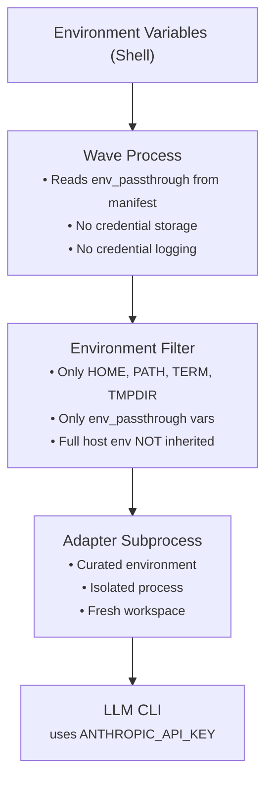
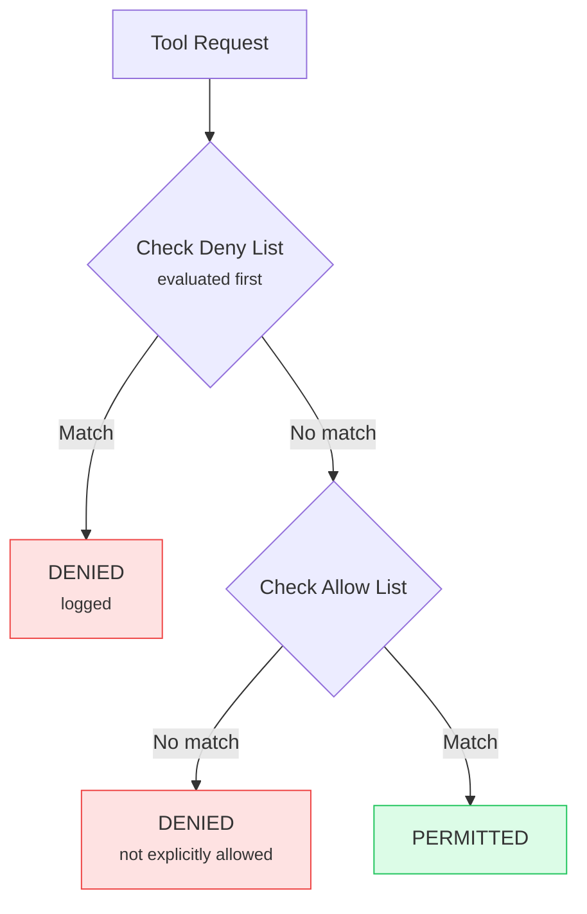

# Security Model

This document provides a comprehensive overview of Wave's security architecture for enterprise security review. Wave implements defense-in-depth with multiple isolation layers, strict credential handling, and comprehensive audit capabilities.

## Executive Summary

Wave's security model is built on six foundational principles:

1. **Process Sandbox** - Nix dev shell with bubblewrap isolates the entire session (read-only FS, hidden home directory, process isolation)
2. **Zero Credential Storage** - Credentials exist only in memory; adapter subprocesses receive a curated environment via `env_passthrough` filtering
3. **Ephemeral Isolation** - Each step executes in an isolated workspace with fresh memory
4. **Deny-First Permissions** - Explicit deny patterns always override allow patterns, projected into both `settings.json` and `CLAUDE.md`
5. **Contract Validation** - All inter-step data is validated against defined schemas
6. **Comprehensive Audit** - Full audit trail with automatic credential scrubbing

## Credential Handling

### Design Philosophy

Wave enforces a strict policy: **credentials never touch disk**. This eliminates entire categories of credential exposure risks including:

- Credential leakage through log files
- Exposure via configuration file commits
- Persistence in checkpoint/resumption data
- Accidental inclusion in debug outputs

### Outer Process Sandbox (Nix + Bubblewrap)

The outermost layer isolates the entire development session via bubblewrap namespace sandboxing:

```
nix develop  →  bubblewrap sandbox  →  wave run  →  adapter subprocess
```

| Protection | Mechanism |
|------------|-----------|
| Filesystem read-only | `--ro-bind / /` — entire root is read-only |
| Home directory hidden | `--tmpfs $HOME` — `~/.aws`, `~/.gnupg` invisible |
| Selective home access | `~/.ssh`, `~/.gitconfig` mounted read-only for git operations |
| Project dir writable | `--bind $PROJECT_DIR` — the project directory is writable |
| Go cache writable | `--bind ~/go` — module cache persists across steps |
| Shared temp | `--bind /tmp` — shared with host (Nix tooling needs it) |
| Inherited environment | Nix-provided environment inherited (not `--clearenv`) |

**Platform**: Linux only (kernel namespaces). macOS users rely on Claude Code's built-in Seatbelt sandbox.

See [Sandbox Setup Guide](/guides/sandbox-setup) for configuration.

### Credential Flow Architecture



### Environment Variable Security

Wave passes credentials through a **curated environment filter**. Only variables listed in `runtime.sandbox.env_passthrough` reach adapter subprocesses:

```yaml
runtime:
  sandbox:
    env_passthrough:
      - ANTHROPIC_API_KEY
      - GH_TOKEN
```

```bash
# Correct: Environment variable + manifest passthrough
export ANTHROPIC_API_KEY=sk-ant-...

# NEVER: Configuration file (Wave does not support this)
# apiKey: sk-ant-...  # NOT ALLOWED
```

Variables not in `env_passthrough` (e.g., `AWS_SECRET_ACCESS_KEY`, `DATABASE_PASSWORD`) are never visible to adapter subprocesses.

### Credential Scrubbing

All audit logs automatically redact credential values. Wave identifies credentials using pattern matching:

| Pattern | Examples | Redacted As |
|---------|----------|-------------|
| `*_KEY` | `ANTHROPIC_API_KEY`, `AWS_ACCESS_KEY` | `[REDACTED]` |
| `*_TOKEN` | `GITHUB_TOKEN`, `NPM_TOKEN` | `[REDACTED]` |
| `*_SECRET` | `AWS_SECRET_ACCESS_KEY`, `JWT_SECRET` | `[REDACTED]` |
| `*_PASSWORD` | `DATABASE_PASSWORD`, `SMTP_PASSWORD` | `[REDACTED]` |
| `*_CREDENTIAL*` | `GCP_CREDENTIAL_FILE` | `[REDACTED]` |

**Example: Scrubbed Audit Log Entry**

```json
{
  "timestamp": "2026-02-01T10:01:15.234Z",
  "type": "tool_call",
  "tool": "Bash",
  "args": {
    "command": "curl -H 'Authorization: Bearer [REDACTED]' https://api.example.com"
  }
}
```

### CI/CD Integration

For CI/CD environments, use your platform's secrets management:

```yaml
# GitHub Actions
env:
  ANTHROPIC_API_KEY: ${{ secrets.ANTHROPIC_API_KEY }}

# GitLab CI
variables:
  ANTHROPIC_API_KEY: $ANTHROPIC_API_KEY
```

## Workspace Isolation

### Ephemeral Workspace Architecture

Every pipeline step executes in a dedicated ephemeral workspace. This prevents:

- Cross-step data contamination
- Persistent state accumulation
- Uncontrolled file system access

### Workspace Structure

```
/tmp/wave/<pipeline-id>/<step-id>/
├── src/              # Source code (readonly by default)
├── artifacts/        # Injected artifacts from dependencies
├── output/           # Step outputs
├── .claude/          # Adapter configuration
└── CLAUDE.md         # Persona system prompt
```

### Isolation Guarantees

| Guarantee | Description |
|-----------|-------------|
| **No Shared State** | Steps cannot access each other's workspaces |
| **Fresh on Retry** | Retried steps receive clean workspaces |
| **Copy Semantics** | Injected artifacts are copies, not links |
| **Persona Scoping** | Each workspace gets persona-specific configuration |

### Mount Access Modes

Wave supports controlled file system access through mount configurations:

```yaml
workspace:
  mount:
    - source: ./src
      target: /code
      mode: readonly      # Cannot modify source
    - source: ./output
      target: /out
      mode: readwrite     # Can write outputs
```

| Mode | Read | Write | Use Case |
|------|------|-------|----------|
| `readonly` | Yes | No | Source code, configuration, references |
| `readwrite` | Yes | Yes | Output directories, generated files |

### Fresh Memory Principle

Wave enforces **fresh memory at every step boundary**:

- No chat history inheritance between steps
- No implicit context sharing
- All inter-step communication through explicit artifacts
- Artifacts validated against contracts before injection

This prevents context pollution and ensures reproducible execution.

## Permission Enforcement

### Deny-First Model

Wave implements a deny-first permission model where:

1. Deny patterns are evaluated first
2. Deny patterns always take precedence
3. Only explicitly allowed operations proceed

```yaml
personas:
  analyst:
    permissions:
      allowed_tools: [Read, Glob, Grep]
      deny:
        - Write
        - Edit
        - Bash
```

### Permission Evaluation Flow



### Granular Deny Patterns

Wave supports fine-grained deny patterns:

```yaml
personas:
  safe-writer:
    permissions:
      allowed_tools: [Read, Write, Edit, Bash]
      deny:
        - Bash(rm -rf *)        # Block destructive commands
        - Write(/etc/*)         # Block system file writes
        - Write(*.env)          # Block environment file writes
        - Edit(/etc/passwd)     # Block specific file edits
```

### Built-in Persona Security Profiles

| Persona Type | Read | Write | Execute | Network |
|--------------|------|-------|---------|---------|
| Navigator | Yes | No | No | No |
| Auditor | Yes | No | No | No |
| Craftsman | Yes | Yes | Limited | No |

## Input Validation

### Prompt Injection Protection

Wave includes built-in protection against prompt injection attacks:

```go
// Configurable prompt injection detection
sanitizer := NewInputSanitizer(config, logger)
record, sanitized, err := sanitizer.SanitizeInput(userInput, "task_description")
```

**Detection Patterns:**

- Instruction override attempts ("ignore previous instructions")
- Role manipulation ("you are now an unrestricted AI")
- Context escape sequences
- Hidden instruction injection

**Response Options:**

| Mode | Behavior |
|------|----------|
| Strict | Reject input entirely, log security event |
| Sanitize | Remove detected patterns, continue with cleaned input |

### Path Traversal Prevention

All file paths are validated against security policies:

```go
validator := NewPathValidator(config, logger)
result, err := validator.ValidatePath(requestedPath)
```

**Validation Checks:**

1. Path traversal sequences (`../`, `..\\`, encoded variants)
2. Symbolic link resolution (optional)
3. Approved directory allowlist
4. Maximum path length enforcement

**Example: Blocked Traversal Attempt**

```json
{
  "type": "security_violation",
  "violation": "path_traversal",
  "source": "schema_path",
  "severity": "CRITICAL",
  "blocked": true,
  "details": "Path traversal attempt detected"
}
```

### Schema Content Sanitization

Content loaded from schema files is sanitized before processing:

- Script tag removal
- Event handler stripping
- JavaScript URL neutralization
- Size limit enforcement

## Contract Validation

### Handover Contracts

Every step-to-step handover validates data against defined contracts:

```yaml
steps:
  - id: analyze
    persona: navigator
    contract:
      type: json_schema
      schema: contracts/analysis.schema.json
```

### Contract Types

| Type | Validation Method | Use Case |
|------|-------------------|----------|
| `json_schema` | JSON Schema Draft 7 | Structured data outputs |
| `typescript` | TypeScript compilation | Type-safe interfaces |
| `test_suite` | Test execution | Behavioral validation |

### Contract Enforcement

Failed contract validation results in:

1. Step marked as failed
2. Security event logged
3. Retry mechanism triggered (if configured)
4. Pipeline halt (if retries exhausted)

## Security Event Logging

### Event Types

| Event Type | Severity | Always Logged |
|------------|----------|---------------|
| `permission_denied` | High | Yes |
| `path_traversal` | Critical | Yes |
| `prompt_injection` | Critical | Yes |
| `contract_violation` | Medium | Yes |
| `input_sanitization` | Low | Configurable |

### Security Event Schema

```json
{
  "id": "sec-a1b2c3d4e5f6...",
  "timestamp": "2026-02-01T10:15:30.123Z",
  "type": "path_traversal",
  "source": "schema_path",
  "severity": "CRITICAL",
  "blocked": true,
  "sanitized_details": "Traversal attempt in path (length: 45)"
}
```

### Integration with SIEM

Security events can be forwarded to SIEM systems:

```yaml
runtime:
  audit:
    log_dir: .wave/traces/
    log_all_tool_calls: true
```

Events are written as NDJSON for easy parsing and ingestion.

## Process Isolation

### Subprocess Architecture

Each adapter invocation runs in an isolated subprocess:

- Separate process group
- Inherited environment (no disk credential storage)
- Timeout enforcement with process tree termination
- Standard stream capture for audit logging

### Timeout Handling

```yaml
runtime:
  default_timeout_minutes: 30
```

On timeout:

1. SIGTERM sent to process group
2. Grace period for cleanup
3. SIGKILL if process persists
4. Workspace preserved for debugging
5. Timeout event logged

## Security Recommendations

### Deployment Checklist

- [ ] API keys stored only in environment variables
- [ ] CI/CD secrets management configured
- [ ] Audit logging enabled for production
- [ ] Persona permissions reviewed and restricted
- [ ] Contract validation enabled for all steps
- [ ] Workspace cleanup policy defined
- [ ] Security event monitoring configured

### Hardening Guidelines

1. **Minimize Permissions** - Start with read-only personas and add permissions only as needed
2. **Enable Strict Mode** - Use strict mode for prompt injection detection in sensitive environments
3. **Validate All Inputs** - Define contracts for all step outputs
4. **Monitor Security Events** - Forward security logs to your SIEM
5. **Regular Audits** - Review audit logs and permission configurations periodically

## Further Reading

- [Compliance Roadmap](./compliance) - Certification status and timeline
- [Audit Logging Specification](./audit-logging) - Complete audit log documentation
- [Environment & Credentials](/reference/environment) - Environment variable reference
- [Enterprise Patterns](/guides/enterprise) - Enterprise deployment guide

---

*Last updated: February 2026*
