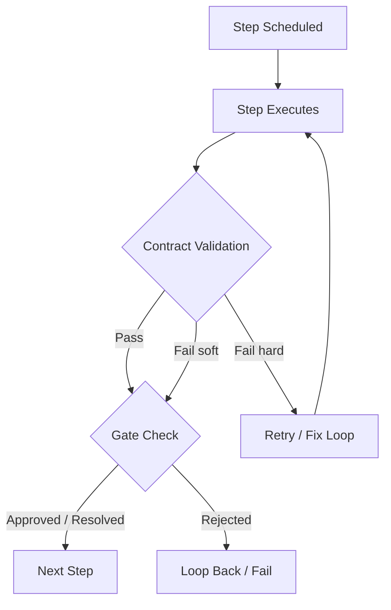

# Verification & Validation Paradigm

Wave uses a two-layer V&V model to ensure pipeline outputs meet structural and behavioral requirements. Each layer operates at a different level of abstraction and catches different classes of problems.

## Layer 1 — Contracts (Structural Validation)

The contract layer validates step output structure before dependent steps proceed. Contracts catch malformed artifacts early, preventing wasted work downstream.

### Contract Types

Wave supports 11 contract types:

| Type | Purpose |
|------|---------|
| `json_schema` | Validates output against a JSON Schema |
| `typescript_interface` | Validates TypeScript compilation |
| `test_suite` | Runs a test command |
| `markdown_spec` | Validates markdown structure |
| `format` | Checks output format |
| `non_empty_file` | Verifies file exists and is non-empty |
| `llm_judge` | LLM evaluates output against criteria |
| `source_diff` | Verifies meaningful code changes were made |
| `agent_review` | Delegates validation to another agent session |
| `event_contains` | Validates specific pipeline events occurred |
| `spec_derived_test` | Generates and runs tests from a specification |

The first 8 types are created via `NewValidator()` (`internal/contract/contract.go:96-119`). `agent_review` uses `ValidateWithRunner()` instead, as it requires an adapter runner. `spec_derived_test` uses `ValidateSpecDerived()`. `event_contains` is handled by `ValidateEventContains()` in the executor.

### Hard vs. Soft Validation

- **Hard** (`must_pass: true`, default): Failure blocks pipeline progression. The step transitions to `retrying` or `failed`.
- **Soft** (`must_pass: false`): Failure logs a warning but does not block. Useful for advisory checks like linting.

See the [Contracts Guide](contracts.md) for configuration details and examples.

## Layer 2 — Gates (Outcome Validation)

The gate layer provides human or automated checkpoints before the pipeline continues. Gates validate outcomes rather than structure.

### Gate Types

| Type | Category | Purpose |
|------|----------|---------|
| `approval` | Human | Pauses for reviewer decision (approve/revise/abort) |
| `timer` | Automated | Waits for a specified duration |
| `pr_merge` | Automated | Polls until a PR is merged or closed |
| `ci_pass` | Automated | Polls until CI checks pass |

Gate execution is dispatched via the `Execute` switch in `internal/pipeline/gate.go:77-88`.

### Fix-Loop Termination

When gates and conditional edges create fix-loops (implement → test → fix → test → ...), three safety mechanisms prevent runaway execution:

1. **Per-step `max_visits`** — Each step has a visit limit (default: 10). Exceeding it fails the pipeline.
2. **Circuit breaker** — If a step fails with the same error 3 consecutive times (`circuitBreakerWindow = 3`), the loop terminates. Errors are normalized before comparison. (`internal/pipeline/graph.go:425-452`)
3. **Graph-level `max_step_visits`** — An aggregate visit limit across all steps, enforced via `EffectiveMaxStepVisits()`. (`internal/pipeline/graph.go:100-104`)

See the [Gates Guide](human-gates.md) for configuration details and the [Graph Loops](graph-loops.md) guide for loop configuration.

## V&V Pipeline Flow

## See Also

- [Validation Philosophy](validation.md) — Why validation matters and the incident that inspired this model
- [Contracts Guide](contracts.md) — Practical configuration for all contract types
- [Gates Guide](human-gates.md) — Human approval and automated gate configuration
- [Graph Loops](graph-loops.md) — Fix-loop configuration and safety mechanisms
