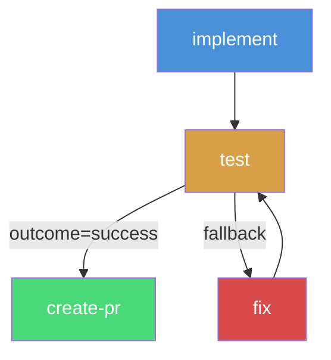

# Graph Loops and Conditional Routing

Wave pipelines support edge-based routing, enabling loops, conditional branches, and retry patterns directly in the pipeline DAG. When a step defines `edges`, the GraphWalker follows those edges instead of the default topological order.

## Edge-Based Routing

Add `edges` to a step to control which step runs next based on the outcome:

<div v-pre>

```yaml
steps:
  - id: test
    persona: craftsman
    dependencies: [implement]
    handover:
      contract:
        type: test_suite
        command: "{{ project.contract_test_command }}"
        on_failure: fail
    edges:
      - target: create-pr
        condition: "outcome=success"
      - target: fix
```

</div>

When `test` succeeds, the pipeline routes to `create-pr`. On failure, it routes to `fix`. An edge with no condition is an unconditional fallback -- first matching condition wins.

## Condition Expressions

Edges use simple condition expressions to decide routing:

| Expression | Matches when |
|------------|-------------|
| `outcome=success` | The step completed successfully |
| `outcome=failure` | The step failed (contract or execution) |
| `context.KEY=VALUE` | A context key set by the step matches the expected value |
| *(empty)* | Always matches (unconditional fallback) |

Conditions are evaluated in declaration order. The first matching edge is taken. Always place specific conditions before fallback edges.

## Visit Limits

Loops need safeguards to prevent infinite execution. Wave provides two levels of visit limits:

### Per-Step Limit: `max_visits`

Each step has a maximum number of times it can be visited. When exceeded, the pipeline fails with an error.

```yaml
steps:
  - id: fix
    persona: craftsman
    max_visits: 3  # Allow up to 3 fix attempts
    edges:
      - target: test
```

The default `max_visits` is **10** per step. Set it explicitly to tighten the bound for steps in tight loops.

### Pipeline-Level Limit: `max_step_visits`

The total number of step visits across the entire pipeline is capped to prevent runaway execution:

```yaml
kind: WavePipeline
metadata:
  name: my-pipeline
max_step_visits: 30  # Total visits across all steps (default: 50)

steps:
  # ...
```

The default `max_step_visits` is **50**. This catches pathological cases where multiple loops interact.

## Circuit Breaker

The GraphWalker tracks the last 3 error messages per step. If all 3 are identical (after normalization), the circuit breaker trips and the pipeline fails immediately. This prevents retrying an error that cannot be fixed by re-execution.

```
circuit breaker triggered for step "fix": same error repeated 3 times: compilation error in main.go
```

The circuit breaker fires even if `max_visits` has not been reached. It detects when retries are futile.

## Conditional Steps

A step with `type: conditional` does not execute any prompt or command. It inherits the outcome from the previous step and evaluates its edges to route the pipeline. Use this for branching logic without spending an adapter call.

```yaml
steps:
  - id: route
    type: conditional
    dependencies: [test]
    edges:
      - target: deploy
        condition: "outcome=success"
      - target: rollback
        condition: "outcome=failure"
```

Conditional steps appear in the execution log but consume zero time and tokens.

## Worked Example: Implement-Test-Fix Loop

The `impl-issue` pipeline uses graph loops for its test-fix cycle. Here is the relevant excerpt:

<div v-pre>

```yaml
steps:
  - id: implement
    persona: craftsman
    dependencies: [plan]
    workspace:
      type: worktree
      branch: "{{ pipeline_id }}"
    exec:
      type: prompt
      source_path: .wave/prompts/implement/implement.md

  - id: test
    persona: craftsman
    dependencies: [implement]
    workspace:
      type: worktree
      branch: "{{ pipeline_id }}"
    exec:
      type: prompt
      source: |
        Run the project test suite to validate the implementation:
        ```bash
        {{ project.contract_test_command }}
        ```
    handover:
      contract:
        type: test_suite
        command: "{{ project.contract_test_command }}"
        on_failure: fail
    edges:
      - target: create-pr
        condition: "outcome=success"
      - target: fix

  - id: fix
    persona: craftsman
    dependencies: [test]
    max_visits: 3
    workspace:
      type: worktree
      branch: "{{ pipeline_id }}"
    exec:
      type: prompt
      source: |
        The test suite failed. Analyze the test failures and fix the implementation.
        Focus on fixing only the failing tests.
    edges:
      - target: test

  - id: create-pr
    persona: craftsman
    dependencies: [test]
    # ...
```

</div>

### Execution Flow



1. `implement` runs the initial implementation.
2. `test` runs the test suite. If tests pass, it routes to `create-pr`.
3. If tests fail, `fix` runs (up to 3 times) and loops back to `test`.
4. If `fix` exceeds `max_visits: 3`, the pipeline fails.

## Best Practices

1. **Set explicit `max_visits`** on steps in loops. The default of 10 is generous -- tighten it to match expected retry budgets.
2. **Place unconditional edges last.** The first matching edge wins, so specific conditions must come before fallbacks.
3. **Use conditional steps for pure routing.** Avoid wasting adapter calls on steps that only branch.
4. **Combine with retry policies.** Graph loops handle step-to-step routing; retry policies handle within-step retries. They compose cleanly.

## Further Reading

- [Pipeline Configuration](/guides/pipeline-configuration) -- Step configuration and dependencies
- [Retry Policies](/guides/retry-policies) -- Within-step retry and failure handling
- [State & Resumption](/guides/state-resumption) -- Resuming pipelines with graph state
