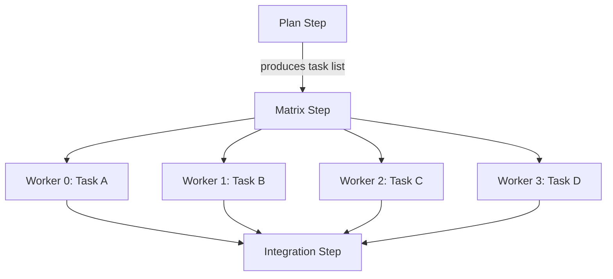

# Matrix Strategies

Matrix strategies enable fan-out parallel execution — spawning multiple agent instances from a task list, each working on an independent sub-task.

## When to Use Matrix

Use matrix when:

- A task can be decomposed into independent sub-tasks.
- Sub-tasks don't depend on each other.
- You want to trade tokens for wall-clock time.

Common examples: implementing multiple API endpoints, migrating multiple components, writing tests for multiple modules.

## How Matrix Works



1. An upstream step produces a JSON task list.
2. The matrix step reads the task list and spawns one worker per item.
3. Each worker runs the same persona with a different `{{ task }}` value.
4. Workers execute in parallel up to `max_concurrency`.
5. All workers must complete before downstream steps start.

## Configuration

### Pipeline YAML

```yaml
steps:
  - id: plan
    persona: philosopher
    memory:
      strategy: fresh
    exec:
      type: prompt
      source: |
        Break down the task into independent sub-tasks.
        Output as JSON: {"tasks": [{"task": "description"}, ...]}
    output_artifacts:
      - name: tasks
        path: output/tasks.json
        type: json

  - id: execute
    persona: craftsman
    dependencies: [plan]
    strategy:
      type: matrix
      items_source: plan/tasks.json    # <step_id>/<artifact_path>
      item_key: task                    # JSON key for each item
      max_concurrency: 4                # Max parallel workers
    memory:
      strategy: fresh
      inject_artifacts:
        - step: plan
          artifact: tasks
          as: task_list
    exec:
      type: prompt
      source: |
        Execute your assigned task: {{ task }}
```

### Task List Format

The task list must be a JSON file with an array of objects:

```json
{
  "tasks": [
    {"task": "Create database migration for users table"},
    {"task": "Implement user registration endpoint"},
    {"task": "Add input validation middleware"},
    {"task": "Write integration tests for auth flow"}
  ]
}
```

The `item_key` field (`task` in this example) determines which JSON key is available as `{{ task }}` in the step's exec source.

## Concurrency Control

```yaml
# Per-step override
strategy:
  max_concurrency: 4

# Global limit in manifest
runtime:
  max_concurrent_workers: 5    # Hard cap across all matrix steps
```

The effective concurrency is `min(step.max_concurrency, runtime.max_concurrent_workers)`.

Workers beyond the concurrency limit are queued and start as running workers complete.

## Conflict Detection

When multiple matrix workers modify the same file, Wave detects the conflict at the merge phase:

```
$ wave run --pipeline parallel-tasks.yaml --input "migrate services"
...
ERROR: Matrix conflict detected in step 'execute'
  Workers 0 and 2 both modified: src/config/database.go
  Worker 0: lines 15-30
  Worker 2: lines 22-45
Pipeline halted. Resolve conflicts and re-run.
```

### Avoiding Conflicts

- **Design tasks to be independent** — each worker should touch different files.
- **Use naming conventions** — e.g., each worker writes to `output/<task-name>/`.
- **Add a merge step** — downstream step resolves conflicts programmatically.

## Matrix Events

Each worker emits events with a `worker_id`:

```json
{"step_id":"execute","state":"running","worker_id":"worker-0","meta":{"task":"Create migration"}}
{"step_id":"execute","state":"running","worker_id":"worker-1","meta":{"task":"Implement endpoint"}}
{"step_id":"execute","state":"completed","worker_id":"worker-0","duration_ms":45000}
{"step_id":"execute","state":"completed","worker_id":"worker-1","duration_ms":62000}
```

## Complete Example

```yaml
kind: WavePipeline
metadata:
  name: parallel-migration
  description: "Migrate microservices in parallel"

steps:
  - id: analyze
    persona: navigator
    memory:
      strategy: fresh
    exec:
      type: prompt
      source: |
        Identify all microservices that need migration.
        For each service, list: name, current state, required changes.
        Output as JSON: {"tasks": [{"task": "service description"}, ...]}
    output_artifacts:
      - name: tasks
        path: output/tasks.json

  - id: migrate
    persona: craftsman
    dependencies: [analyze]
    strategy:
      type: matrix
      items_source: analyze/tasks.json
      item_key: task
      max_concurrency: 3
    memory:
      strategy: fresh
    exec:
      type: prompt
      source: |
        Migrate the following service: {{ task }}
        Update dependencies, APIs, and tests.
    handover:
      contract:
        type: test_suite
        command: "go test ./..."
        must_pass: true
        max_retries: 2

  - id: integration
    persona: auditor
    dependencies: [migrate]
    memory:
      strategy: fresh
    exec:
      type: prompt
      source: |
        Verify all migrated services work together.
        Run integration tests and check for conflicts.
```

## Further Reading

- [Pipeline Schema — MatrixStrategy](/reference/pipeline-schema#matrixstrategy) — field reference
- [Events Reference](/reference/events) — matrix worker event format
- [Pipelines](/concepts/pipelines) — parallelism in DAG execution
