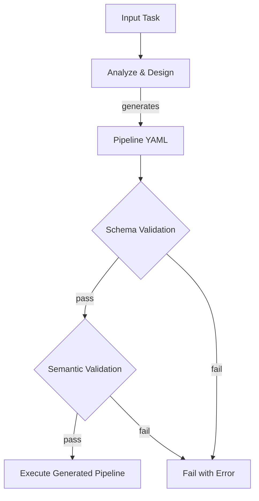

# Meta-Pipelines

Meta-pipelines allow a persona to **design a pipeline at runtime**. For novel problems that don't fit existing templates, the philosopher persona generates a custom pipeline definition, which Wave validates and executes.

## When to Use Meta-Pipelines

Use meta-pipelines when:

- The task is too novel for existing pipeline templates.
- The required steps aren't known until the codebase is analyzed.
- You want AI-designed workflows without manual pipeline authoring.

Most work should use standard templates. Meta-pipelines are expensive (extra LLM calls for design) and complex (generated pipelines need validation).

## How Meta-Pipelines Work



1. The philosopher persona receives the task and codebase context.
2. It generates a complete pipeline YAML definition.
3. Wave validates the generated pipeline:
   - **Schema validation** — valid YAML, required fields, correct types.
   - **Semantic validation** — first step is navigator, all steps have contracts, fresh memory strategy.
4. **Schema files are automatically generated** for each step's contract validation.
5. If valid, Wave executes the generated pipeline.
6. Recursion depth is tracked to prevent infinite meta-generation.

## Automatic Schema Generation

**New Feature**: Meta-pipelines now automatically generate JSON schemas for contract validation.

When the philosopher generates a pipeline, it creates:

1. **Pipeline YAML** with proper step definitions
2. **JSON Schemas** for each step's expected output format
3. **Output artifacts** configuration for proper file handling

**Example generated schema** (`.wave/contracts/navigation-analysis.schema.json`):

```json
{
  "$schema": "http://json-schema.org/draft-07/schema#",
  "type": "object",
  "required": ["files", "patterns", "dependencies", "impact_areas"],
  "properties": {
    "files": {
      "type": "array",
      "items": {"type": "string"},
      "description": "Key files relevant to the task"
    },
    "patterns": {
      "type": "object",
      "properties": {
        "architecture": {"type": "string"},
        "conventions": {"type": "string"}
      }
    }
  }
}
```

**Benefits:**
- ✅ **Perfect alignment** between steps and contracts
- ✅ **Automatic validation** of data flow between steps
- ✅ **No manual schema writing** required
- ✅ **Type safety** for complex multi-step pipelines

## Configuration

### Manifest Limits

```yaml
runtime:
  meta_pipeline:
    max_depth: 2              # Max recursion (meta generating meta)
    max_total_steps: 20       # Max steps across all levels
    max_total_tokens: 500000  # Max total token consumption
    timeout_minutes: 60       # Hard timeout for entire tree
```

### Meta-Pipeline Template

<div v-pre>

```yaml
kind: WavePipeline
metadata:
  name: auto-design
  description: "Self-designing pipeline for novel tasks"

steps:
  - id: analyze
    persona: philosopher
    memory:
      strategy: fresh
    exec:
      type: prompt
      source: |
        Analyze this request and design a pipeline: {{ input }}

        Requirements for the generated pipeline:
        - MUST start with a navigator step
        - Every step MUST have a handover contract
        - ALL steps MUST use fresh memory strategy
        - Consider parallel execution where tasks are independent
        - Use personas defined in the project manifest

        Output a valid WavePipeline YAML definition.
    output_artifacts:
      - name: pipeline
        path: output/pipeline.yaml
    handover:
      contract:
        type: json_schema
        schema_path: .wave/contracts/pipeline.schema.json
        source: output/pipeline.yaml
        on_failure: retry
        max_retries: 2

  - id: execute
    persona: meta-executor
    dependencies: [analyze]
    memory:
      strategy: fresh
      inject_artifacts:
        - step: analyze
          artifact: pipeline
          as: generated_pipeline
    exec:
      type: prompt
      source: |
        Execute the generated pipeline from the analyze step.
        Validate it, then run it with full depth tracking.
```

</div>

## Semantic Validation Rules

Generated pipelines must satisfy these rules beyond schema correctness:

| Rule | Description |
|------|-------------|
| Navigator first | Step[0] must use a navigator persona (or explicitly override). |
| Contracts present | Every step must have a handover contract. |
| **Schema files exist** | **All referenced schema files must exist and be valid JSON.** |
| **Output artifacts** | **Steps with json_schema contracts must have output_artifacts config.** |
| Fresh memory | All steps must use `strategy: fresh`. |
| Valid personas | All referenced personas must exist in the manifest. |
| No cycles | Step dependencies must form a valid DAG. |
| Depth check | Recursion depth must be within `max_depth`. |

## Recursion Limits

Meta-pipelines track recursion depth via an internal `--parent-pipeline` flag:

```
Level 0: User triggers meta-pipeline
Level 1: Generated pipeline executes
Level 2: If generated pipeline itself is a meta-pipeline (rare)
```

At `max_depth`, attempts to generate another meta-pipeline are blocked:

```json
{"step_id":"analyze","state":"failed","error":"Meta-pipeline depth limit exceeded (max: 2)"}
```

## Debugging Meta-Pipelines

Generated pipeline definitions are preserved for inspection:

```bash
# Find the generated pipeline
ls /tmp/wave/<pipeline-id>/analyze/output/pipeline.yaml

# Inspect it
cat /tmp/wave/<pipeline-id>/analyze/output/pipeline.yaml

# Validate it standalone
wave validate --pipeline /tmp/wave/<pipeline-id>/analyze/output/pipeline.yaml
```

## Best Practices

1. **Set conservative limits** — `max_depth: 2` prevents runaway recursion.
2. **Require contracts in generated pipelines** — the semantic validator enforces this.
3. **Save generated pipelines** — useful for learning what the philosopher designs.
4. **Prefer standard templates** — meta-pipelines are powerful but expensive. If a task fits an existing template, use the template.
5. **Review generated pipelines** — before production use, inspect what the philosopher creates.

## Further Reading

- [Manifest Schema — MetaPipelineConfig](/reference/manifest-schema#metapipelineconfig) — limit fields
- [Personas](/concepts/personas) — philosopher and meta-executor roles
- [Pipelines](/concepts/pipelines) — pipeline DAG execution
