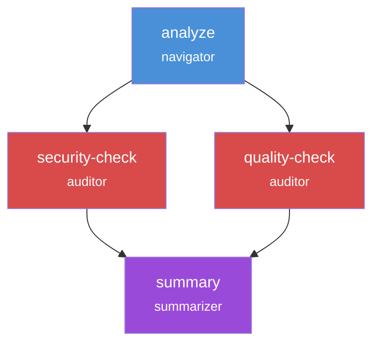

# Pipeline Configuration Guide

This guide walks through creating and configuring Wave pipelines from basic single-step workflows to complex multi-step orchestrations with dependencies and artifact passing.

## Prerequisites

- Wave installed (`wave --version`)
- Initialized Wave project (`wave init`)
- Basic familiarity with YAML syntax

## Pipeline Basics

Every Wave pipeline starts with a YAML file defining the workflow structure:

<div v-pre>

```yaml
kind: WavePipeline
metadata:
  name: my-pipeline
  description: "What this pipeline does"

input:
  source: cli

steps:
  - id: step-name
    persona: navigator
    exec:
      type: prompt
      source: "Your task: {{ input }}"
```

</div>

### Required Fields

| Field | Description |
|-------|-------------|
| `kind` | Must be `WavePipeline` |
| `metadata.name` | Pipeline identifier (used with `wave run`) |
| `steps` | Array of step definitions |
| `steps[].id` | Unique identifier for the step |
| `steps[].persona` | Which AI persona executes this step |
| `steps[].exec` | What the step should do |

## Step Configuration

### Basic Step

The simplest step runs a prompt with a persona:

<div v-pre>

```yaml
steps:
  - id: analyze
    persona: navigator
    exec:
      type: prompt
      source: "Analyze the following: {{ input }}"
```

</div>

### Step with Worktree Workspace

Give the step a full git checkout on a dedicated branch:

<div v-pre>

```yaml
steps:
  - id: review
    persona: navigator
    workspace:
      type: worktree
      branch: "{{ pipeline_id }}"
    exec:
      type: prompt
      source: "Review the codebase"
```

</div>

Steps sharing the same branch share the same worktree — changes from one step are visible to the next.

### Step with Mount Workspace

For fine-grained access control, mount specific directories:

```yaml
steps:
  - id: review
    persona: navigator
    workspace:
      mount:
        - source: ./src
          target: /code
          mode: readonly
    exec:
      type: prompt
      source: "Review the code in /code"
```

Mount modes:
- `readonly` - Can read files but not modify
- `readwrite` - Full file access

### Step with Memory Strategy

Control how context is managed:

```yaml
steps:
  - id: implement
    persona: craftsman
    memory:
      strategy: fresh  # Start with clean context
    exec:
      type: prompt
      source: "Implement the feature"
```

Memory strategies:
- `fresh` - No history from previous steps (recommended)
- `inherit` - Carry forward previous context (use carefully)

## Dependencies

### Linear Pipeline

Steps execute in order when dependencies are specified:

<div v-pre>

```yaml
steps:
  - id: plan
    persona: navigator
    exec:
      type: prompt
      source: "Create a plan for: {{ input }}"

  - id: implement
    persona: craftsman
    dependencies: [plan]
    exec:
      type: prompt
      source: "Execute the plan"
```

</div>

### Parallel Execution

Steps without mutual dependencies run in parallel:

<div v-pre>

```yaml
steps:
  - id: analyze
    persona: navigator
    exec:
      type: prompt
      source: "Analyze: {{ input }}"

  - id: security-check
    persona: auditor
    dependencies: [analyze]
    exec:
      type: prompt
      source: "Security review"

  - id: quality-check
    persona: auditor
    dependencies: [analyze]
    exec:
      type: prompt
      source: "Quality review"

  - id: summary
    persona: summarizer
    dependencies: [security-check, quality-check]
    exec:
      type: prompt
      source: "Summarize all findings"
```

</div>

In this pipeline:
1. `analyze` runs first
2. `security-check` and `quality-check` run in parallel
3. `summary` runs after both checks complete

### Dependency Visualization



## Artifacts

Artifacts are files passed between steps. They enable data flow in complex pipelines.

### Producing Artifacts

Declare what a step outputs:

```yaml
steps:
  - id: analyze
    persona: navigator
    exec:
      type: prompt
      source: |
        Analyze the codebase and output JSON:
        {
          "files": [...],
          "patterns": [...],
          "recommendations": [...]
        }
    output_artifacts:
      - name: analysis
        path: .wave/output/analysis.json
        type: json
```

### Consuming Artifacts

Inject artifacts from previous steps:

```yaml
steps:
  - id: implement
    persona: craftsman
    dependencies: [analyze]
    memory:
      strategy: fresh
      inject_artifacts:
        - step: analyze
          artifact: analysis
          as: context
    exec:
      type: prompt
      source: |
        The analysis is available at: .wave/artifacts/context
        Implement based on these findings.
```

The artifact is copied to the step's workspace at `.wave/artifacts/<as-name>`.

### Artifact Types

| Type | Description | Use Case |
|------|-------------|----------|
| `json` | Structured JSON data | Analysis results, configurations |
| `markdown` | Formatted text | Reports, documentation |
| `file` | Any single file | Code files, configs |
| `directory` | Folder with multiple files | Generated code, assets |

### Complete Artifact Flow Example

```yaml
kind: WavePipeline
metadata:
  name: full-review
  description: "Multi-step code review with artifact passing"

steps:
  - id: diff-analysis
    persona: navigator
    workspace:
      mount:
        - source: ./
          target: /src
          mode: readonly
    exec:
      type: prompt
      source: |
        Analyze changes and output as JSON:
        {
          "files_changed": [...],
          "modules_affected": [...],
          "breaking_changes": []
        }
    output_artifacts:
      - name: diff
        path: .wave/output/diff.json
        type: json

  - id: security-review
    persona: auditor
    dependencies: [diff-analysis]
    memory:
      strategy: fresh
      inject_artifacts:
        - step: diff-analysis
          artifact: diff
          as: changes
    exec:
      type: prompt
      source: |
        Review the changes at .wave/artifacts/changes for:
        - SQL injection
        - XSS vulnerabilities
        - Hardcoded secrets
    output_artifacts:
      - name: security
        path: .wave/output/security.md
        type: markdown

  - id: final-report
    persona: summarizer
    dependencies: [security-review]
    memory:
      strategy: fresh
      inject_artifacts:
        - step: diff-analysis
          artifact: diff
          as: changes
        - step: security-review
          artifact: security
          as: security_report
    exec:
      type: prompt
      source: |
        Combine the analysis and security findings into
        a final review report.
    output_artifacts:
      - name: report
        path: .wave/output/final-report.md
        type: markdown
```

## Contracts

Contracts validate step outputs before the pipeline continues.

### JSON Schema Contract

```yaml
steps:
  - id: analyze
    persona: navigator
    exec:
      type: prompt
      source: "Output analysis as JSON"
    output_artifacts:
      - name: analysis
        path: .wave/output/analysis.json
        type: json
    handover:
      contract:
        type: json_schema
        schema_path: .wave/contracts/analysis.schema.json
        source: .wave/output/analysis.json
        on_failure: retry
        max_retries: 2
```

### Test Suite Contract

```yaml
steps:
  - id: implement
    persona: craftsman
    exec:
      type: prompt
      source: "Implement and ensure tests pass"
    handover:
      contract:
        type: test_suite
        command: "go test ./..."
        must_pass: true
        on_failure: retry
        max_retries: 3
```

### Contract Failure Handling

| Option | Behavior |
|--------|----------|
| `retry` | Re-run the step (up to max_retries) |
| `fail` | Stop the pipeline |
| `warn` | Continue with a warning |

## Common Patterns

### Fan-Out Pattern

One step feeds multiple parallel reviewers:

```yaml
steps:
  - id: analyze
    persona: navigator
    # ... produces analysis

  - id: security
    persona: auditor
    dependencies: [analyze]
    # ... security review

  - id: performance
    persona: auditor
    dependencies: [analyze]
    # ... performance review

  - id: accessibility
    persona: auditor
    dependencies: [analyze]
    # ... accessibility review
```

### Fan-In Pattern

Multiple steps converge to a summary:

```yaml
steps:
  # ... multiple review steps ...

  - id: summary
    persona: summarizer
    dependencies: [security, performance, accessibility]
    memory:
      inject_artifacts:
        - step: security
          artifact: report
          as: security
        - step: performance
          artifact: report
          as: performance
        - step: accessibility
          artifact: report
          as: accessibility
```

### Pipeline-of-Pipelines

Reference other pipelines as steps:

<div v-pre>

```yaml
steps:
  - id: review
    pipeline: code-review
    input: "{{ input }}"

  - id: deploy
    persona: craftsman
    dependencies: [review]
```

</div>

## Best Practices

### 1. Keep Steps Focused

Each step should do one thing well:

```yaml
# Good - Single responsibility
steps:
  - id: analyze
    # Only analysis
  - id: implement
    # Only implementation

# Avoid - Too much in one step
steps:
  - id: do-everything
    # Analysis + implementation + testing
```

### 2. Use Fresh Memory

Always start with fresh context unless you have a specific reason not to:

```yaml
memory:
  strategy: fresh  # Prevents context pollution
```

### 3. Define Clear Artifacts

Name artifacts descriptively and specify types:

```yaml
output_artifacts:
  - name: security-findings  # Clear purpose
    path: .wave/output/security.json
    type: json  # Explicit type
```

### 4. Add Contracts for Critical Steps

Validate important outputs:

```yaml
handover:
  contract:
    type: json_schema
    schema_path: .wave/contracts/analysis.schema.json
```

### 5. Use Readonly Mounts

Mount source code as readonly unless the step needs to modify files:

```yaml
workspace:
  mount:
    - source: ./src
      target: /code
      mode: readonly  # Safe default
```

## Try It: Interactive Playground

Use the YAML playground below to experiment with pipeline configurations:

<YamlPlayground />

## Example Pipelines

Explore complete, working pipeline examples:

- [Code Review Pipeline](/examples/code-review.yaml) - Multi-step PR review
- [Security Audit Pipeline](/examples/security-audit.yaml) - Security-focused analysis
- [Documentation Pipeline](/examples/documentation.yaml) - Auto-generate docs

## Next Steps

- [Concepts: Pipelines](/concepts/pipelines) - Core pipeline concepts
- [Concepts: Artifacts](/concepts/artifacts) - Deep dive into artifact passing
- [Concepts: Contracts](/concepts/contracts) - Output validation
- [Reference: Pipeline Schema](/reference/pipeline-schema) - Complete field reference
