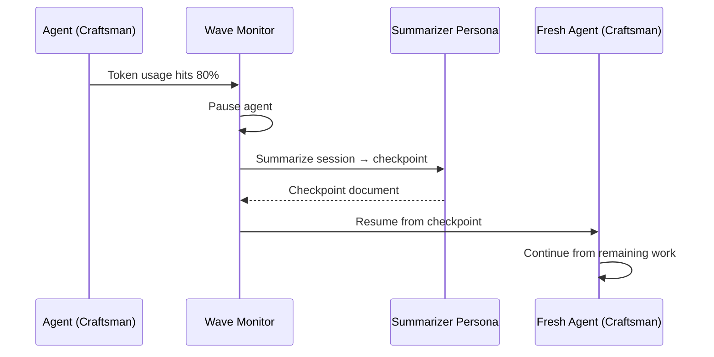

# Context Relay & Compaction

Long-running agent tasks degrade silently as context fills up. The relay mechanism solves this by compacting context at a configurable threshold, handing off to a fresh instance with a structured checkpoint.

## The Problem

LLM agents have finite context windows. As a step executes, the context accumulates:

- System prompt
- Tool call history
- File contents read
- Intermediate reasoning

At ~80% utilization, output quality degrades — the agent loses track of earlier decisions, repeats work, or contradicts itself.

## How Relay Works



1. **Monitor** — Wave tracks token usage during step execution.
2. **Trigger** — At the configured threshold (default 80%), relay fires.
3. **Summarize** — A separate summarizer persona receives the full session history and produces a structured checkpoint.
4. **Resume** — A fresh instance of the original persona starts with the checkpoint injected as initial context.

## Configuration

### Manifest Settings

```yaml
runtime:
  relay:
    token_threshold_percent: 80          # Trigger at 80% context usage
    strategy: summarize_to_checkpoint    # Only strategy currently
```

### Per-Step Override

```yaml
steps:
  - id: implement
    handover:
      compaction:
        trigger: "token_limit_80%"      # Per-step threshold
        persona: summarizer             # Which persona summarizes
```

### Summarizer Persona

The summarizer needs minimal permissions — it only reads the session and writes a checkpoint:

```yaml
personas:
  summarizer:
    adapter: claude
    system_prompt_file: .wave/personas/summarizer.md
    temperature: 0.0    # Deterministic — no creativity needed
    permissions:
      allowed_tools: ["Read"]
      deny: ["Write(*)", "Bash(*)"]
```

## Checkpoint Structure

The summarizer produces a structured document:

```markdown
# Relay Checkpoint

## Completed Work
- Created user model in src/models/user.go
- Added migration in db/migrations/003_users.sql
- Implemented GET /users endpoint

## Current State
- Working on POST /users endpoint
- User validation logic partially complete
- Test file created but not populated

## Modified Files
- src/models/user.go (new)
- src/handlers/users.go (new, incomplete)
- db/migrations/003_users.sql (new)
- src/routes/api.go (modified — added /users routes)

## Remaining Work
1. Complete POST /users handler with validation
2. Add authentication middleware integration
3. Write unit tests for user model
4. Write integration tests for /users endpoints
5. Update API documentation

## Resume Instructions
Continue from step 1 of remaining work. The POST handler
skeleton exists in src/handlers/users.go — complete the
validation logic and error handling.
```

## Relay Events

Relay triggers emit events in the NDJSON stream:

```json
{"timestamp":"...","step_id":"implement","state":"running","message":"Context relay triggered at 82% utilization","meta":{"token_usage_percent":82,"strategy":"summarize_to_checkpoint"}}
{"timestamp":"...","step_id":"implement","state":"running","message":"Summarizer checkpoint complete","meta":{"checkpoint_tokens":1200}}
{"timestamp":"...","step_id":"implement","state":"running","message":"Resumed from relay checkpoint","meta":{"relay_count":1}}
```

## Edge Cases

### Summarizer Hits Its Own Limit

The summarizer has a hard token cap. If the session is too large to summarize within that cap, the pipeline **halts** rather than entering infinite compaction. This is a safety mechanism — it's better to fail clearly than to loop.

### Multiple Relays Per Step

A single step can relay multiple times. Each relay increments the relay count. The fresh instance receives only the most recent checkpoint, not the full chain.

### Relay During Matrix Execution

Each matrix worker has its own independent relay tracking. Worker A relaying does not affect worker B.

## Best Practices

1. **Set thresholds conservatively** — 80% is a good default. Going higher risks degradation before relay fires.
2. **Keep summarizer prompts focused** — the summarizer should produce structured, actionable checkpoints, not narrative summaries.
3. **Use relay for implementation steps** — navigation and review steps rarely need relay because they're shorter.
4. **Monitor relay frequency** — frequent relays may indicate steps that should be broken into smaller sub-steps.

## Further Reading

- [Manifest Schema — RelayConfig](/reference/manifest-schema#relayconfig) — field reference
- [Pipeline Schema — CompactionConfig](/reference/pipeline-schema#compactionconfig) — per-step config
- [Architecture](/concepts/architecture) — how relay fits into the system
