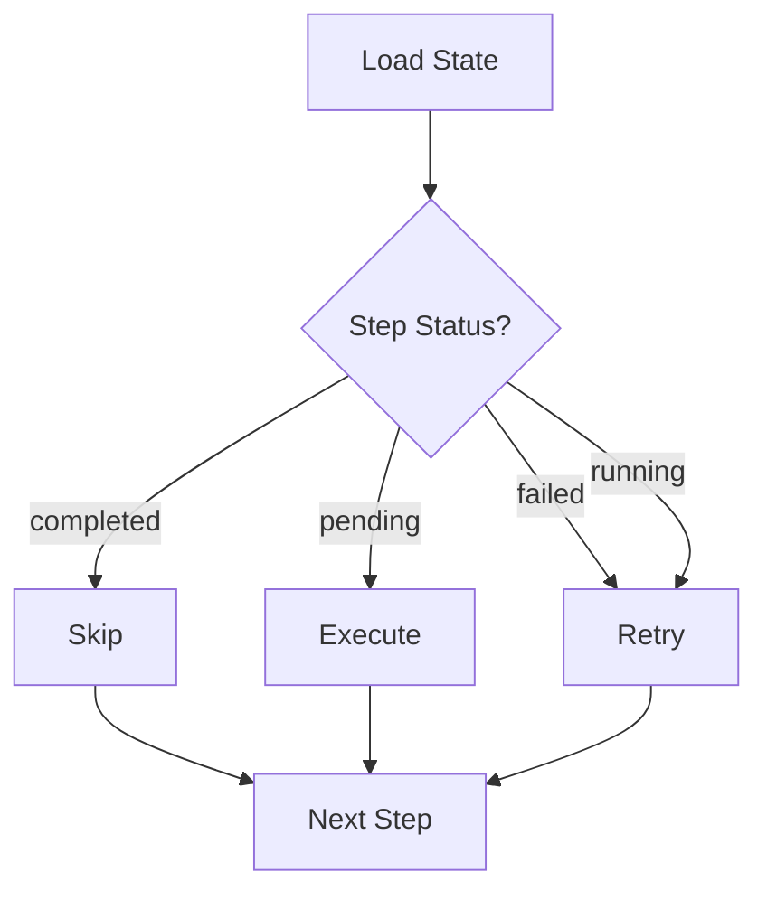

# State & Resumption

Wave persists pipeline execution state in SQLite, enabling interrupted pipelines to resume from their last completed step rather than starting over.

## State Persistence

Every step state transition is written to a local SQLite database:

```
.wave/state.db
├── pipeline_state    # Pipeline-level status
└── step_state        # Per-step status, timing, errors
```

### Pipeline State Schema

| Field | Type | Description |
|-------|------|-------------|
| `pipeline_id` | `string (PK)` | UUID for this execution instance. |
| `pipeline_name` | `string` | Name from pipeline YAML. |
| `status` | `string` | `queued`, `running`, `completed`, `failed`. |
| `created_at` | `timestamp` | When execution started. |
| `updated_at` | `timestamp` | Last state change. |
| `input` | `text` | The input that triggered this pipeline. |

### Step State Schema

| Field | Type | Description |
|-------|------|-------------|
| `step_id` | `string (PK)` | Step ID from pipeline YAML. |
| `pipeline_id` | `string (FK)` | Parent pipeline UUID. |
| `state` | `string` | `pending`, `running`, `completed`, `failed`, `retrying`. |
| `retry_count` | `int` | Current retry attempt. |
| `started_at` | `timestamp` | When step began. |
| `completed_at` | `timestamp` | When step finished. |
| `workspace_path` | `string` | Ephemeral workspace directory. |
| `error_message` | `text` | Last error if failed/retrying. |

## Resuming Pipelines

### After Interruption (Ctrl+C, crash, CI timeout)

```bash
# Find the pipeline ID from previous output or list runs
wave list runs

# Resume from last checkpoint (auto-recovers input from previous run)
wave run <pipeline-name> --from-step <step>
```

### Resume Behavior

1. Wave loads the pipeline state from SQLite.
2. Identifies step states:
   - `completed` → **skipped** (artifacts already in workspace).
   - `pending` → **executed** normally.
   - `failed` → **retried** with fresh workspace and full retry budget.
   - `running` → treated as **failed** (was interrupted mid-execution).
3. Resumes execution from the first non-completed step.



### Override Resume Point

```bash
# Skip ahead to a specific step
wave run <pipeline-name> --from-step implement

# Resume from a specific previous run
wave run <pipeline-name> --from-step implement --run <run-id>
```

This marks all steps before `implement` as completed (their workspace artifacts must exist) and starts execution from `implement`. Input is auto-recovered from the most recent run unless `--input` or `--run` is specified.

## Interruption Safety

When Wave receives SIGINT (Ctrl+C):

1. Current step state is persisted.
2. Adapter subprocess is killed (entire process group).
3. Workspace is preserved.
4. Exit code 130 is returned.
5. Pipeline can be resumed with `wave run <pipeline> --from-step <step>`.

### What's Preserved

| Data | Preserved | Location |
|------|-----------|----------|
| Step states | Yes | SQLite `.wave/state.db` |
| Completed artifacts | Yes | Workspace directories |
| In-progress work | Partial | Current step's workspace (may be incomplete) |
| Relay checkpoints | Yes | Checkpoint files in workspace |

### What's Lost

- In-progress adapter output (the interrupted LLM call).
- Any work the current step did after the last artifact write.

## Listing Runs

```bash
$ wave list runs
PIPELINE-ID   NAME           STATUS      STARTED              STEPS
a1b2c3d4      spec-develop   completed   2026-02-01 10:00:00  5/5
e5f6a7b8      bug-fix        failed      2026-01-30 14:30:00  2/4
f9g0h1i2      ad-hoc-1234    running     2026-02-01 15:00:00  1/2
```

```bash
$ wave list runs --output json
[
  {
    "pipeline_id": "a1b2c3d4",
    "pipeline_name": "spec-develop",
    "status": "completed",
    "created_at": "2026-02-01T10:00:00Z",
    "steps_completed": 5,
    "steps_total": 5
  }
]
```

## State and Workspaces

State persistence and workspace persistence are independent:

- `wave clean` deletes workspaces but **does not** delete state records.
- State records remain in SQLite even after cleanup.
- Resuming a pipeline after `wave clean` will fail because artifacts are gone.

::: warning
Always resume interrupted pipelines **before** cleaning their workspaces.
:::

## Further Reading

- [CLI Reference — resume](/reference/cli#wave-resume) — resume command details
- [CLI Reference — list](/reference/cli#wave-list) — listing runs
- [Workspaces](/concepts/workspaces) — workspace lifecycle
- [Events](/reference/events) — monitoring pipeline progress
