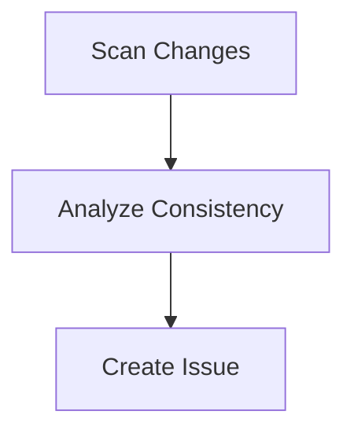

# Documentation Consistency

Pre-PR documentation consistency gate that scans code changes, cross-references docs, and creates a GitHub issue with inconsistencies.

## Prerequisites

- `gh` CLI authenticated with repo access

## Overview



The doc-loop pipeline catches documentation drift before it reaches main. It compares code changes against docs, CLI help text, and README content, then opens a GitHub issue listing every mismatch.

## Running

```bash
# Scan branch diff against main
wave run doc-loop

# Full scan of all documentation
wave run doc-loop "full"

# Scan against a specific ref
wave run doc-loop "v0.2.0"
```

## Expected Output

```
[10:00:01] started   scan-changes        (navigator)              Starting step
[10:01:12] completed scan-changes        (navigator)   71s   4.2k Scan complete
[10:01:13] started   analyze-consistency (reviewer)               Starting step
[10:03:45] completed analyze-consistency (reviewer)   152s   6.1k Analysis complete
[10:03:46] started   create-issue        (github-analyst)         Starting step
[10:04:22] completed create-issue        (github-analyst)  36s   1.4k Issue created

Pipeline doc-loop completed in 4m 21s
Artifacts: output/issue-result.json
```

## Steps

| Step | Persona | Description |
|------|---------|-------------|
| `scan-changes` | navigator | Categorize changed files, snapshot documentation state |
| `analyze-consistency` | reviewer | Cross-reference code against docs, rate severity |
| `create-issue` | github-analyst | Create GitHub issue with task list of inconsistencies |

## Artifacts

| Artifact | Path | Description |
|----------|------|-------------|
| `scan-results` | `output/scan-results.json` | Changed files by category, doc snapshots |
| `consistency-report` | `output/consistency-report.json` | Inconsistencies with severity ratings |
| `issue-result` | `output/issue-result.json` | Created issue number, URL, or skip status |
