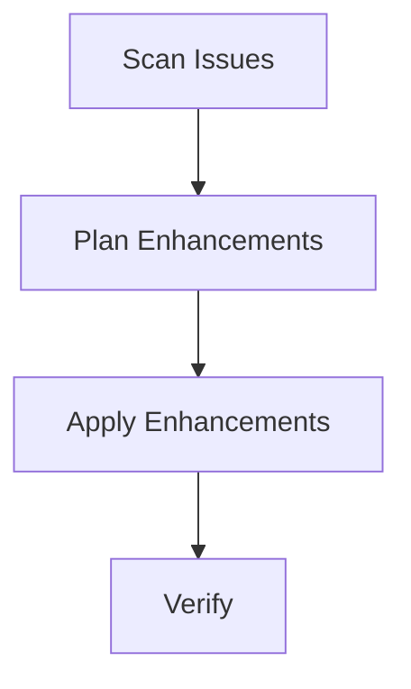

# Issue Enhancement

Scan GitHub issues for poor documentation, generate improvements, and apply them automatically.

## Prerequisites

- `gh` CLI authenticated with write access to the target repository

## Overview



The github-issue-enhancer pipeline finds poorly documented issues, rewrites titles and bodies with proper structure, adds labels, and verifies the changes were applied.

## Running

```bash
# Enhance a single issue
wave run github-issue-enhancer "re-cinq/wave 42"

# Batch mode — scan and enhance up to 10 issues
wave run github-issue-enhancer "re-cinq/wave"
```

## Expected Output

With `-o text`:

```
[10:00:01] → scan-issues (github-analyst)
[10:00:01]   scan-issues: Executing agent
[10:00:38] ✓ scan-issues completed (37.0s, 2.8k tokens)
[10:00:39] → plan-enhancements (github-analyst)
[10:01:52] ✓ plan-enhancements completed (73.0s, 3.5k tokens)
[10:01:53] → apply-enhancements (github-enhancer)
[10:02:41] ✓ apply-enhancements completed (48.0s, 1.9k tokens)
[10:02:42] → verify-enhancements (github-analyst)
[10:03:15] ✓ verify-enhancements completed (33.0s, 1.2k tokens)

  ✓ Pipeline 'github-issue-enhancer' completed successfully (3m 14s)
```

## Steps

| Step | Persona | Description |
|------|---------|-------------|
| `scan-issues` | github-analyst | Fetch and score issue quality |
| `plan-enhancements` | github-analyst | Draft improved titles, bodies, labels |
| `apply-enhancements` | github-enhancer | Apply changes via `gh issue edit` |
| `verify-enhancements` | github-analyst | Re-fetch issues and verify changes stuck |

## Artifacts

| Artifact | Path | Description |
|----------|------|-------------|
| `issue_analysis` | `artifact.json` | Quality scores and poor-quality issue list |
| `enhancement_plan` | `artifact.json` | Suggested titles, bodies, labels per issue |
| `enhancement_results` | `artifact.json` | Applied changes and success/failure counts |
| `verification_report` | `artifact.json` | Post-apply verification results |
