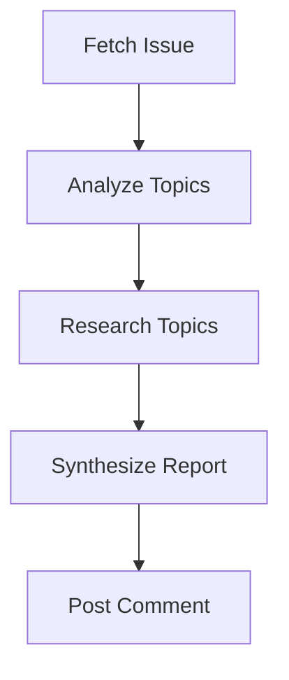

# Issue Research

Research a GitHub issue using web search, synthesize findings into a structured report, and post it as a comment.

## Prerequisites

- `gh` CLI authenticated with write access to the target repository

## Overview



The issue-research pipeline takes a GitHub issue, extracts research questions, performs web searches, synthesizes findings, and posts a structured research comment back on the issue.

## Running

```bash
wave run issue-research "re-cinq/wave 42"
```

## Expected Output

```
[10:00:01] started   fetch-issue       (github-analyst)         Starting step
[10:00:18] completed fetch-issue       (github-analyst)  17s   1.1k Fetched
[10:00:19] started   analyze-topics    (researcher)             Starting step
[10:01:34] completed analyze-topics    (researcher)     75s   3.2k Topics identified
[10:01:35] started   research-topics   (researcher)             Starting step
[10:04:12] completed research-topics   (researcher)    157s   7.4k Research complete
[10:04:13] started   synthesize-report (summarizer)             Starting step
[10:05:28] completed synthesize-report (summarizer)     75s   4.1k Report synthesized
[10:05:29] started   post-comment      (github-commenter)      Starting step
[10:05:52] completed post-comment      (github-commenter) 23s  0.8k Comment posted

Pipeline issue-research completed in 5m 51s
Artifacts: output/comment-result.json
```

## Steps

| Step | Persona | Description |
|------|---------|-------------|
| `fetch-issue` | github-analyst | Fetch issue content via `gh` CLI |
| `analyze-topics` | researcher | Extract research questions and keywords |
| `research-topics` | researcher | Web search per topic, evaluate sources |
| `synthesize-report` | summarizer | Combine findings into structured report |
| `post-comment` | github-commenter | Post report as GitHub issue comment |

## Artifacts

| Artifact | Path | Description |
|----------|------|-------------|
| `issue-content` | `output/issue-content.json` | Raw issue data |
| `topics` | `output/research-topics.json` | Research topics with search keywords |
| `findings` | `output/research-findings.json` | Per-topic research results with sources |
| `report` | `output/research-report.json` | Synthesized report with recommendations |
| `comment-result` | `output/comment-result.json` | Posted comment URL and status |
