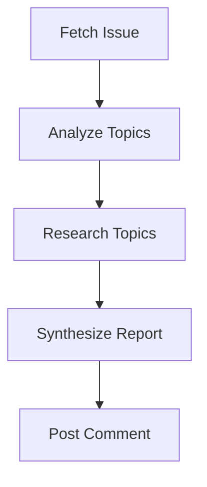

# Issue Research

Research a GitHub issue using web search, synthesize findings into a structured report, and post it as a comment.

## Prerequisites

- `gh` CLI authenticated with write access to the target repository

## Overview



The issue-research pipeline takes a GitHub issue, extracts research questions, performs web searches, synthesizes findings, and posts a structured research comment back on the issue.

## Running

```bash
wave run issue-research "re-cinq/wave 42"
```

## Expected Output

With `-o text`:

```
[10:00:01] → fetch-issue (github-analyst)
[10:00:01]   fetch-issue: Executing agent
[10:00:18] ✓ fetch-issue completed (17.0s, 1.1k tokens)
[10:00:19] → analyze-topics (researcher)
[10:01:34] ✓ analyze-topics completed (75.0s, 3.2k tokens)
[10:01:35] → research-topics (researcher)
[10:04:12] ✓ research-topics completed (157.0s, 7.4k tokens)
[10:04:13] → synthesize-report (summarizer)
[10:05:28] ✓ synthesize-report completed (75.0s, 4.1k tokens)
[10:05:29] → post-comment (github-commenter)
[10:05:52] ✓ post-comment completed (23.0s, 0.8k tokens)

  ✓ Pipeline 'issue-research' completed successfully (5m 51s)
```

## Steps

| Step | Persona | Description |
|------|---------|-------------|
| `fetch-issue` | github-analyst | Fetch issue content via `gh` CLI |
| `analyze-topics` | researcher | Extract research questions and keywords |
| `research-topics` | researcher | Web search per topic, evaluate sources |
| `synthesize-report` | summarizer | Combine findings into structured report |
| `post-comment` | github-commenter | Post report as GitHub issue comment |

## Artifacts

| Artifact | Path | Description |
|----------|------|-------------|
| `issue-content` | `output/issue-content.json` | Raw issue data |
| `topics` | `output/research-topics.json` | Research topics with search keywords |
| `findings` | `output/research-findings.json` | Per-topic research results with sources |
| `report` | `output/research-report.json` | Synthesized report with recommendations |
| `comment-result` | `output/comment-result.json` | Posted comment URL and status |
